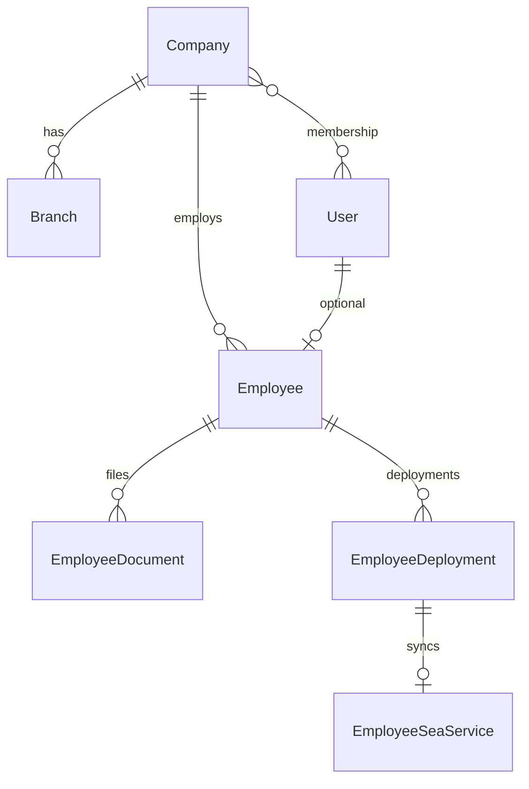

# AI Guide (OMS-HRM)

Entry point for AI agents working in this repository. Read this file first — it replaces the need to scan conversation history or the entire codebase.

**Deeper docs:** [docs/architecture/project-analysis.md](docs/architecture/project-analysis.md) · [docs/architecture/domains.md](docs/architecture/domains.md) · [docs/architecture/golden-files.md](docs/architecture/golden-files.md) · [docs/permissions.md](docs/permissions.md) · [AGENTS.md](AGENTS.md) (Laravel Boost rules + skills)

**Cursor rules:** `.cursor/rules/` (domain-specific rule files; start with `project-rules.mdc`)

---

## Stack

| Layer | Technology |
|-------|------------|
| Backend | Laravel 13, PHP 8.4 |
| Frontend | Inertia v3, React 19, TypeScript |
| Styling | Tailwind CSS v4, shadcn/ui (new-york) |
| Auth | Laravel Fortify (+ 2FA) |
| Permissions | Spatie Laravel Permission (teams = `company_id`) |
| Audit | Spatie Activity Log |
| Routes (FE) | Laravel Wayfinder (`@/routes`, `@/actions`) |
| Tests | Pest v4 |
| Formatting | Pint (PHP), Prettier + ESLint (TS) |

---

## 1. Architecture overview

OMS-HRM is a **multi-tenant HR / crew operations monolith**. There is **no REST API layer** (`routes/api.php` is empty). The browser loads an Inertia SPA; Laravel renders pages with props and handles mutations via form posts.

```
Browser
  └── Fortify auth + SetCurrentCompany middleware
        └── Route middleware (can:permission)
              └── Controller → Support/Services
                    └── Inertia::render() → React (resources/js)
                          └── Wayfinder typed routes/actions
```

| Concern | Pattern |
|---------|---------|
| Data fetching | Server Inertia props — **not** React Query |
| Mutations | `useForm`, `<Form>`, `router.post/put/delete` |
| Authorization | Spatie permissions + route `can:` middleware |
| Domain logic | `app/Support/` (queries, actions, presenters) |
| Integrations | `app/Services/` (email, WhatsApp, PDF merge, Hikvision) |
| Tenancy | Session `current_company_id` scopes all org data |

**Do not introduce:** REST APIs, React Query/TanStack Query, Redux/Zustand, Eloquent policies, TanStack Table, client-side validation libraries (Zod/Yup).

---

## 2. Folder structure

### Backend

```
app/
├── Http/Controllers/     Grouped by domain (Organization, Settings, Attendance, Hikvision)
├── Http/Requests/      Form validation (~127 files, domain subfolders)
├── Http/Middleware/      SetCurrentCompany, HandleInertiaRequests
├── Models/               Eloquent + LogsActivityWithCompany
├── Support/              Domain queries, actions, guards (preferred for business logic)
├── Services/             External integrations
└── Actions/              Fortify user actions

routes/web.php            Main org routes
routes/settings.php       Settings + master data
tests/Feature/            Pest feature tests
tests/Support/            grantCompanyPermissions(), fixtures
```

### Frontend

```
resources/js/
├── pages/                Inertia entrypoints — keep THIN
├── features/             Domain UI (fat screens, dialogs, rows)
├── components/           Shared cross-domain UI
│   └── ui/               shadcn/Radix primitives (do not duplicate)
├── hooks/                Global custom hooks (13 files)
├── layouts/              app-layout, auth-layout, settings
├── lib/                  utils, toast, design-system
├── types/                Global TS + Inertia augmentation
├── routes/               Wayfinder generated — DO NOT EDIT
└── actions/              Wayfinder generated — DO NOT EDIT
```

### Page colocation (exception for complex screens)

```
pages/organization/
├── employee.tsx          Profile hub (large)
├── _components/          Tab panels
├── _hooks/               Profile form hooks
└── _lib/                 Template field helpers
```

**Rule:** New simple CRUD → thin page + `features/{domain}/`. Do not create new top-level folders without approval.

---

## 3. Domain relationships

Multi-company HR system. All org data scoped by `company_id`.



| Domain | Purpose | Key models |
|--------|---------|------------|
| **Companies** | Tenant root | `Company` |
| **Branches** | Sites under company | `Branch` |
| **Employees** | HR records + profile tabs | `Employee`, sub-records (contract, training, …) |
| **Documents** | Employee files, expiry, sharing | `EmployeeDocument`, `EmployeeDocumentVersion` |
| **Crew deployments** | Deployment lifecycle | `EmployeeDeployment` → `EmployeeSeaService` |
| **Users** | Login accounts | `User`, `company_user` pivot |
| **Roles** | Permission bundles per company | Spatie `Role` with `company_id` |

Full domain map: [docs/architecture/domains.md](docs/architecture/domains.md)

### Tenancy flow

1. User logs in → `SetCurrentCompany` sets session `current_company_id`.
2. Spatie `PermissionRegistrar::setPermissionsTeamId($companyId)`.
3. Controllers read `(int) $request->attributes->get('current_company_id')`.
4. User switches company via sidebar → `CompanySwitchController`.

**Never** trust client-supplied `company_id` for authorization.

---

## 4. Permission system

- **Spatie Permission** with **teams enabled** — team key = `company_id` (`config/permission.php`).
- **No Eloquent policies** — routes use `->middleware('can:permission.name')`.
- Permissions seeded in `database/seeders/PermissionsSeeder.php` (dot notation: `employees.view`, `documents.upload`).
- Re-seed after adding permissions: `php artisan db:seed --class=PermissionsSeeder`

### Backend (authoritative)

```php
Route::get('organization/branches', [BranchController::class, 'index'])
    ->middleware('can:branches.view');
```

Module-specific UI flags via Support classes:

```php
'can' => DocumentPagePermissions::for($request->user()),
```

Static guards for cross-entity checks: `DocumentAccess::assertEmployeeInCompany(...)`.

### Frontend (UX only)

| Need | API |
|------|-----|
| Module actions | Page `can` prop from controller |
| Nav / cross-cutting | `useHasPermission('branches.create')` |
| Settings master data | `useSettingsMasterDataCan('genders')` |

Shared Inertia: `auth.permissions[]`, `auth.roles[]` from `HandleInertiaRequests`.

### Audit permission

`audit.view` gates Activity logs page and `RecentActivityCard` on show pages. Without it, return `recent_activity: []`.

Details: [docs/permissions.md](docs/permissions.md)

---

## 5. Reusable components

Use existing components before creating new ones.

### Layout & list chrome

| Component | Path |
|-----------|------|
| `Main` | `components/layout/main.tsx` |
| `PageHeader` | `components/page-header.tsx` |
| `SearchBar` | `components/search-bar.tsx` |
| `DetailsHeader` | `components/details-header.tsx` |
| `Pagination` | `components/pagination.tsx` |
| `EmptyState` | `components/empty-state.tsx` |
| `ExportMenu` | `components/export-menu.tsx` |
| `ViewToggle` | `components/view-toggle.tsx` |
| `FiltersSheet` | `components/filters-sheet.tsx` |

### Data display

| Component | Path |
|-----------|------|
| `OrganizationDataTable` | `components/data-table.tsx` |
| `ListTableCrudActions` | `components/list-table-actions.tsx` |
| `RecentActivityCard` | `components/recent-activity-card.tsx` |
| `InputError` | `components/input-error.tsx` |
| `AppSelect` | `components/app-select.tsx` |

### Styling helpers

- `cn()` — `lib/utils.ts`
- Design tokens — `lib/design-system.ts`, CSS class `glass-card`
- Icons — `lucide-react` only; verify export exists before using new icons

---

## 6. Hooks

Global hooks live in `resources/js/hooks/`. Prefer these over writing new ones.

| Hook | Purpose |
|------|---------|
| `useServerPaginationFilters` | Debounced search + filter + page `router.get()` |
| `useHasPermission` | Check `auth.permissions` |
| `useSettingsMasterDataCan` | Master-data CRUD flags |
| `useViewPreference` | Persist grid/table in localStorage |
| `useDialogState` | Toggle one-of-many dialog IDs |
| `useCreatableMasterData` | Inline master-data creation |
| `useAppearance` | Theme light/dark/system |

Domain hooks colocate in `features/{domain}/` (e.g. `use-documents-index-filters.ts`, `use-ensure-employee.ts`).

**No global state store.** State = Inertia props + local `useState` + `useForm`.

---

## 7. Tables

- Use **`OrganizationDataTable`** + shadcn `Table` — **not** TanStack Table.
- Cell/row classes from `components/data-table.tsx`: `dataTableBodyRowClass()`, `dataTableCellClass()`, `dataTableActionsCellClass()`.
- Row actions: `ListTableCrudActions` (View/Edit/Delete) or domain wrapper (`DocumentListRowActions`).
- **Row click → show page** where detail pages exist; `stopPropagation` on action column and checkboxes.
- Extract domain rows to `*-table-row.tsx` when columns are non-trivial.
- Server pagination via `Pagination` + `useServerPaginationFilters`.

Golden row: `features/organization/documents/document-compliance-table-row.tsx`

---

## 8. Dialogs

| UI | Use for | Example |
|----|---------|---------|
| **Sheet** (right) | Create / edit forms | `branch-form-sheet.tsx` |
| **AlertDialog** | Delete confirmation | `confirm-delete-dialog.tsx` |
| **Dialog** (center) | Heavy workflows (upload, merge) | `upload-dialog.tsx` |
| **FiltersSheet** | Filter panels | `filters-sheet.tsx` |

State pattern:

```tsx
const [editDoc, setEditDoc] = useState<Item | null>(null);
const [deleteId, setDeleteId] = useState<number | null>(null);
```

Lazy-load heavy modals: `lazy(() => import('...'))` + `Suspense`.

**Do not** use center Dialog for standard CRUD — use Sheet.

---

## 9. Forms

**Server-side validation only** — Laravel Form Requests. No Zod, Yup, or react-hook-form.

### Feature CRUD (`useForm`)

```tsx
const form = useForm<BranchFormData>({ name: '', ... });
form.put(`/organization/branches/${id}`, { preserveScroll: true, onSuccess: () => setIsSheetOpen(false) });
```

Parent owns form; sheet receives `form: InertiaFormProps<T>`.

### Auth (`<Form>`)

```tsx
<Form {...store.form()} resetOnSuccess={['password']}>
  {({ processing, errors }) => ( ... )}
</Form>
```

### Errors

- Inline: `form.errors.field`
- Shared: `<InputError message={form.errors.name} />`
- Partial reload after save: `{ only: ['document'] }` or `partialReloadKeys` prop

### Flash / toasts

- Prefer server flash: `->with('success', '...')` on redirect.
- Client toasts via `components/http-exception-toasts.tsx` — **do not** duplicate success toasts in `onSuccess`.

---

## 10. Backend patterns

### Controllers

- **No `Route::resource()`** — explicit routes per action in `routes/web.php`.
- **Multi-action** controllers for CRUD + export (`BranchController`).
- **Invokable** controllers for single-purpose endpoints (`EmployeeDocumentShowController`, `DocumentsFolderIndexController`).
- Controllers: HTTP + Inertia render + redirect/flash. Logic → Support.

```php
$companyId = (int) $request->attributes->get('current_company_id');
return Inertia::render('organization/documents/show', [
    'document' => $document->toShowArray(),
    'can' => DocumentPagePermissions::for($request->user()),
    'recent_activity' => RecentActivityQuery::for($user, $companyId, EmployeeDocument::class, $document->id),
    'can_view_audit' => $user?->can('audit.view') ?? false,
]);
```

### Support vs Services

| Layer | Use | Examples |
|-------|-----|----------|
| `app/Support/` | Queries, actions, guards, array mappers | `DocumentBrowseQuery`, `CreateEmployee`, `DocumentAccess` |
| `app/Services/` | External integrations | `DocumentEmailService`, `WhatsAppService` |

Support "Resources" are static `toArray()` mappers — not Laravel API Resources.

### Form Requests

`app/Http/Requests/{Domain}/Store*.php` — shared rules in `Concerns/` traits.

### Show pages

Pass `recent_activity` + `can_view_audit`. Use `RecentActivityQuery::for()` (returns `[]` without `audit.view`).

### Formatting

After PHP changes: `vendor/bin/pint --dirty --format agent`

---

## 11. TypeScript patterns

| Scope | Location |
|-------|----------|
| Global | `resources/js/types/` (`PaginationMeta`, auth types) |
| Domain | `features/{domain}/types.ts` |
| Inertia shared | `types/global.d.ts` (module augmentation) |

- Explicit prop interfaces on pages/features.
- `import type { ... }` for types.
- Wayfinder for typed URLs — prefer over hardcoded paths in **new** code.
- Avoid `any`. No runtime schema validation on frontend.
- Check: `npm run types:check`

---

## 12. Testing patterns

Framework: **Pest v4** with `RefreshDatabase` on Feature tests.

```php
test('authorized user can load show page', function () {
    $user = User::factory()->create();
    $this->actingAs($user);

    ['company' => $company, 'employee' => $employee, ...] = makeDocumentFixtures();
    grantCompanyPermissions($user, $company, ['documents.view']);

    $this->get("/organization/documents/employees/{$employee->id}/files/{$document->id}")
        ->assertOk()
        ->assertInertia(fn (Assert $page) => $page
            ->component('organization/documents/show')
            ->where('document.id', $document->id)
        );
});
```

| Helper | File |
|--------|------|
| `grantCompanyPermissions()` | `tests/Support/spatie.php` |
| `makeDocumentFixtures()` | `tests/Support/document-fixtures.php` |

- **Every change needs a test** — run targeted: `php artisan test --compact tests/Feature/.../FileTest.php`
- Test permission denied **and** allowed paths.
- Do not delete tests without approval.

---

## 13. Performance considerations

- **Inertia partial reloads** — `{ only: ['documents'] }` instead of full page refresh after mutations.
- **Debounce search** — `useServerPaginationFilters` (400ms default).
- **Eager load** relations in controllers/Support before array mapping.
- **`withCount()`** for list metrics — avoid N+1.
- **Lazy-load** heavy modals (PDF merge, upload).
- **No client-side caching layers** (React Query, etc.).
- Shared props cached ~60s in `HandleInertiaRequests` — don't re-fetch permissions client-side.

---

## 14. Golden reference files

Copy patterns from these before inventing new ones. Full rationale: [docs/architecture/golden-files.md](docs/architecture/golden-files.md)

| Category | File |
|----------|------|
| Index page | `features/organization/branches/index.tsx` |
| Show page | `pages/organization/documents/show.tsx` |
| Form sheet | `features/organization/branches/components/branch-form-sheet.tsx` |
| Table row | `features/organization/documents/document-compliance-table-row.tsx` |
| Delete dialog | `components/confirm-delete-dialog.tsx` |
| Upload modal | `pages/organization/_components/documents/upload-dialog.tsx` |
| List hook | `hooks/use-server-pagination-filters.ts` |
| Domain filter hook | `features/organization/documents/use-documents-index-filters.ts` |
| Permissions | `app/Support/EmployeeDocuments/DocumentPagePermissions.php` |
| Show controller | `app/Http/Controllers/Organization/EmployeeDocumentShowController.php` |
| Query Support | `app/Support/EmployeeDocuments/DocumentBrowseQuery.php` |
| File upload | `app/Support/EmployeeDocuments/StoresEmployeeDocument.php` |
| Delete flow | `features/organization/documents/shared/document-management-dialogs.tsx` |
| Bulk actions | `pages/organization/documents/employee.tsx` + `use-bulk-selection.ts` |

---

## 15. Common mistakes to avoid

### Architecture

- ❌ Adding React Query, Redux, or a REST API layer
- ❌ Creating Eloquent policies (use Spatie + route middleware)
- ❌ Putting business logic in controllers instead of `app/Support/`
- ❌ Creating new top-level folders without approval
- ❌ Using `Route::resource()`

### Tenancy & security

- ❌ Querying without `company_id` scope
- ❌ Trusting client-supplied `company_id`
- ❌ Hiding UI actions without backend middleware (UI gating is not security)
- ❌ Checking permissions outside Spatie team context

### Frontend

- ❌ Fat Inertia pages for new simple CRUD (use thin page + feature)
- ❌ TanStack Table instead of `OrganizationDataTable`
- ❌ Dialog for standard create/edit (use Sheet)
- ❌ Preview modals when a show page exists (navigate on row click)
- ❌ Hardcoded URLs in new code when Wayfinder route exists
- ❌ Editing `resources/js/routes/` or `resources/js/actions/` manually
- ❌ Client-side validation libraries (Zod/Yup/react-hook-form)
- ❌ Duplicate success toasts when server already flashes
- ❌ Page props named `companies` (collides with shared switcher prop)

### Backend

- ❌ Inline validation in controllers (use Form Requests)
- ❌ Fetching audit data without checking `audit.view`
- ❌ N+1 queries on show pages (use `withCount`, eager `load()`)

### Testing

- ❌ Skipping tests on changes
- ❌ Forgetting `grantCompanyPermissions()` in org feature tests
- ❌ Running Pint on unchanged PHP or skipping it on changed PHP

### Documents module specifics

- Index search is **not** an "Active filter" chip — only expiry chips on compliance view.
- Folder search matches employee name/number; document field search uses `searchDocuments`.
- `DocumentPagePermissions` drives `can` on document pages.
- Show page owns inline preview + version history (not list modals).
- Back navigation uses `from` query: `employee-browse` | `index` | `profile`.

See [docs/document-search.md](docs/document-search.md), [docs/document-management.md](docs/document-management.md).

---

## Domain-specific notes

### Employee onboarding

- Template builder: `/onboarding/templates/*` (`OnboardingTemplateController`)
- Create flow: `/organization/employees/create` — dynamic fields from onboarding template
- Backend: `EmployeeController@store` + `CreateEmployee` action (employee + contract + bank + documents)
- Profile driven by `EmployeeProfileTemplate` — field visibility via template helpers in `pages/organization/_lib/`

### Users ↔ employees

- Link: `SyncUserEmployeeLink`, optional `CopyEmployeeAvatarToUser`
- Create login from employee: `EmployeeUserController` (requires `users.create`)

### Crew deployments

- Saves sync sea service via `SyncSeaServiceFromDeployment` when join/disembark dates complete
- Permissions: `crew_operations.deployments.view|create|update|delete|export`, `crew_operations.vessel_manning.view|create|update|delete`

### Exports

Support `format=csv|xlsx|pdf`; respect current search/filters via query string.

---

## Quality checklist (every change)

1. Follow patterns in sibling files and golden references.
2. Scope queries by `current_company_id`.
3. Add/update Pest test; run `php artisan test --compact <file>`.
4. Run `vendor/bin/pint --dirty` if PHP changed.
5. Run `npm run lint:check` if TS/React changed.
6. Prefer Wayfinder routes in new frontend code.
7. Reuse existing components — extend, don't reinvent.

---

## Quick links

| Doc | Contents |
|-----|----------|
| [docs/architecture/project-analysis.md](docs/architecture/project-analysis.md) | Full technical analysis |
| [docs/architecture/domains.md](docs/architecture/domains.md) | Business domains + workflows |
| [docs/architecture/golden-files.md](docs/architecture/golden-files.md) | Best reference implementations |
| [docs/README.md](docs/README.md) | Product docs index |
| [AGENTS.md](AGENTS.md) | Laravel Boost agent rules + skill activation |
