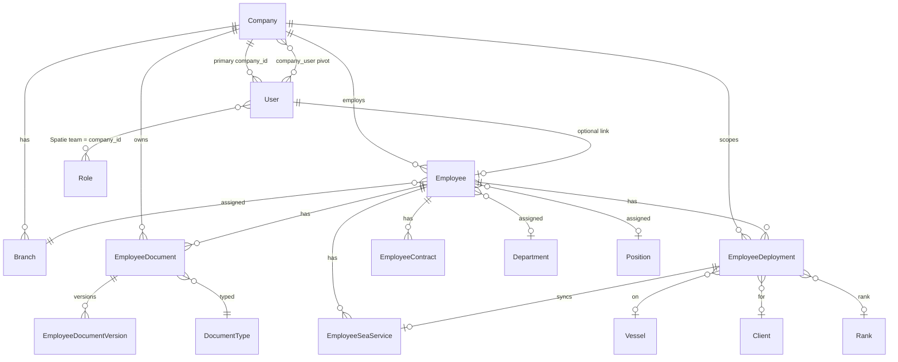
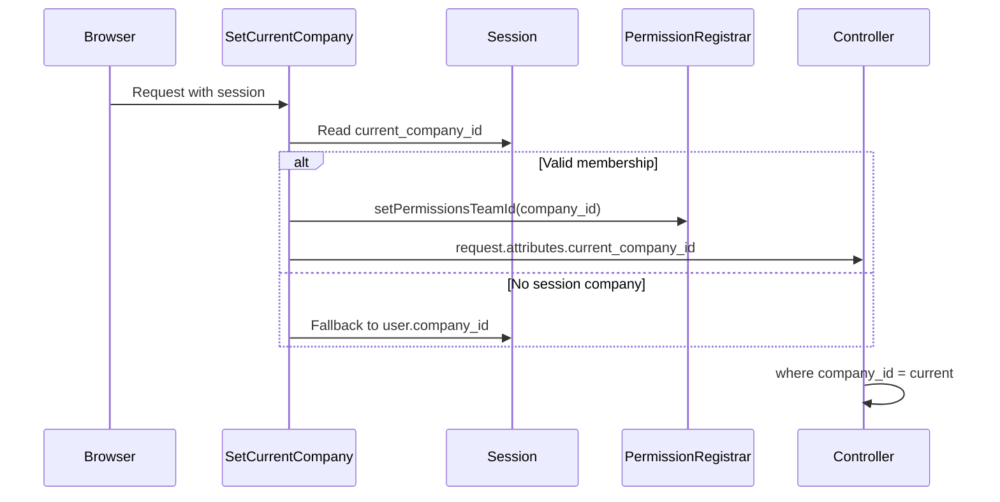
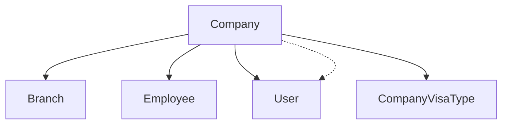
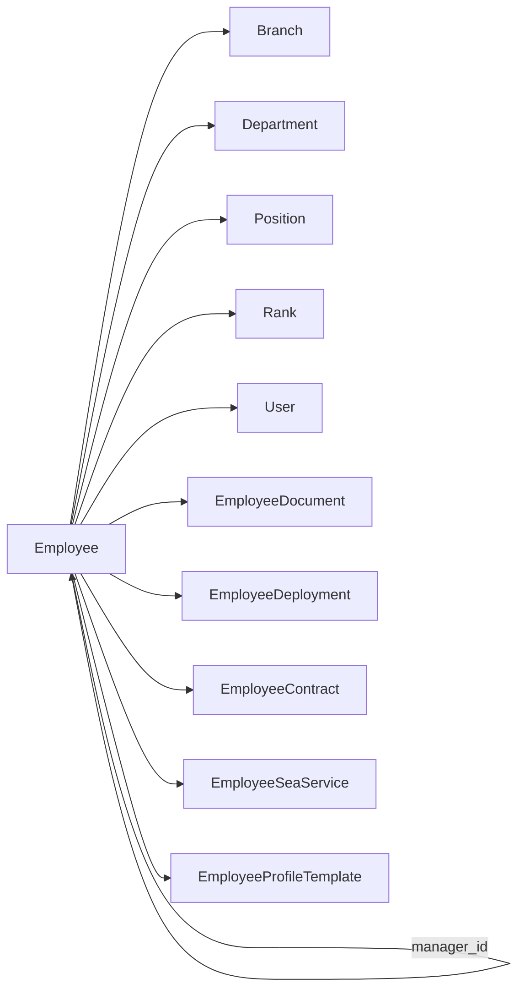
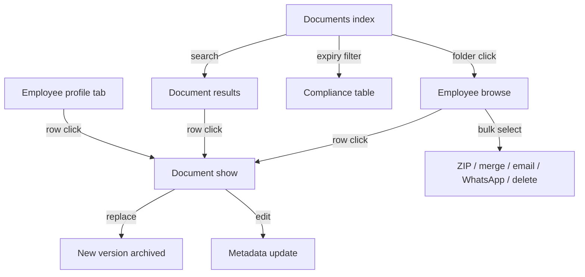
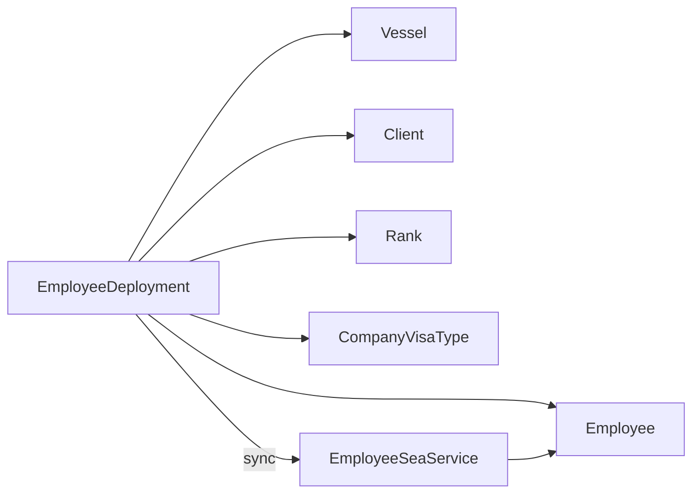
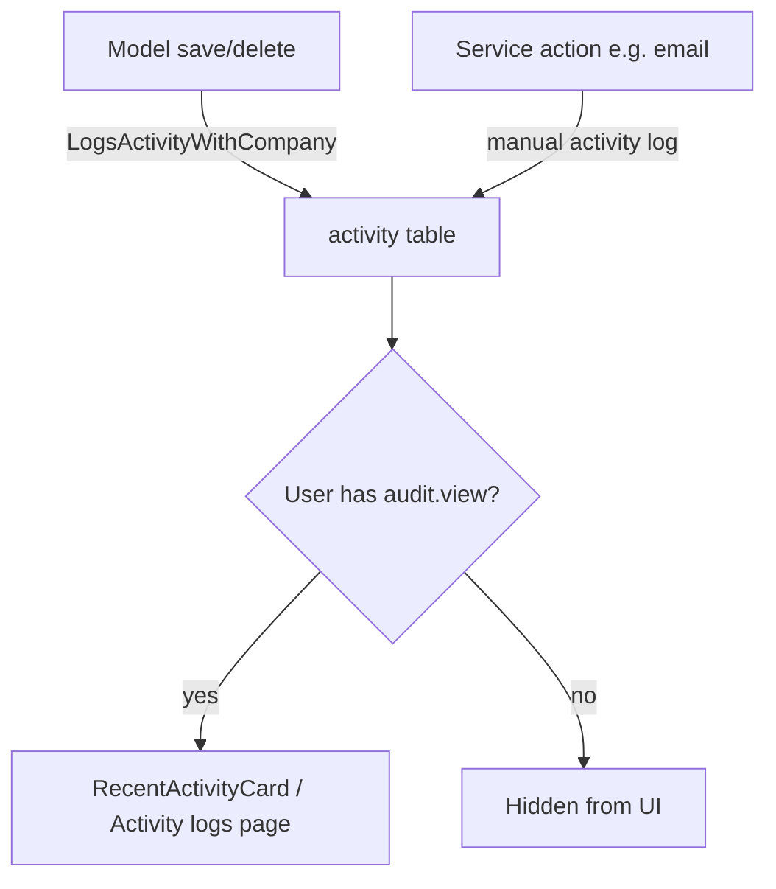
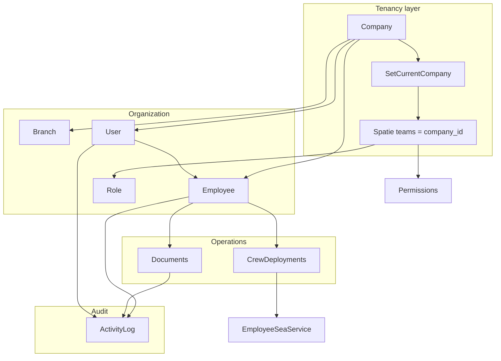

# Business Domains

Domain map for OMS-HRM — a multi-company HR and crew operations system. Each section describes purpose, data model, UI surface, permissions, and key workflows as implemented in this repository.

Related: [project-analysis.md](./project-analysis.md) · [golden-files.md](./golden-files.md) · [docs/permissions.md](../permissions.md)

---

## Domain overview

Most operational data is **scoped by `company_id`**. Users switch the active company in the sidebar; permissions and queries run in that tenant context.

---

## Tenancy

### Purpose

Isolate HR data per organization (company). A single login may access multiple companies via membership; all list/show queries and permission checks use the **currently selected company**.

### Main models

| Model / table | Role |
|---------------|------|
| `Company` | Tenant root — settings, currency, country, payroll config |
| `company_user` pivot | Many-to-many user ↔ company membership with `status` |
| Session `current_company_id` | Active tenant for the request |

There is no separate `Team` Eloquent model. **Team** in Spatie terms = **`company_id`** (see [Teams](#teams)).

### Relationships

- `Company` → `hasMany` `Branch`, `Employee`, documents, deployments, etc.
- `Company` ↔ `User` via `company_user` (membership) and `users.company_id` (primary/home company).

### Controllers / middleware

| File | Role |
|------|------|
| `app/Http/Middleware/SetCurrentCompany.php` | Resolves session company, sets request attribute, sets Spatie team ID |
| `app/Http/Controllers/Organization/CompanySwitchController.php` | POST switch active company |
| `app/Http/Middleware/HandleInertiaRequests.php` | Shares `company_switcher_companies`, `current_company_id` |

### Pages / components

- Company switcher in app sidebar (`components/layout/app-sidebar.tsx`)
- Shared Inertia props consumed across all org pages

### Permissions involved

Tenancy itself is not permission-gated; switching requires membership on `company_user` or matching `users.company_id`.

### Important workflows

1. User logs in (Fortify).
2. `SetCurrentCompany` picks session company or falls back to `user.company_id`.
3. All org controllers read `(int) $request->attributes->get('current_company_id')`.
4. User switches company via sidebar → `CompanySwitchController` → `session('current_company_id')`.

**Future code must:** never trust client-supplied `company_id` for authorization; always scope queries by request attribute.

---

## Teams

### Purpose

In OMS-HRM, **“teams” means Spatie Permission teams**, not a standalone Teams module. Each company is a permission team: roles and direct user permissions are stored with `company_id` on Spatie pivot tables.

### Main models / tables

| Artifact | Role |
|----------|------|
| `config/permission.php` → `'teams' => true` | Enables team feature |
| `team_foreign_key` → `company_id` | Company scopes roles/assignments |
| `spatie_roles` | Roles per company (`roles.company_id`) |
| `spatie_model_has_roles` | User ↔ role with `company_id` team column |
| `spatie_model_has_permissions` | Direct permissions with `company_id` |
| `company_user` | Which companies a user may access (membership, not RBAC) |

### Relationships

- User has roles **per company team** via Spatie.
- User may belong to many companies via `company_user` but holds **different role assignments per company**.

### Controllers

- Role assignment happens in `UserController` (store/update/memberships) with `PermissionRegistrar::setPermissionsTeamId($companyId)`.
- `RoleController` lists/creates roles scoped to `company_id`.

### Pages / components

- `resources/js/pages/organization/roles.tsx` — role matrix per company
- `resources/js/pages/organization/user.tsx` — assign role when editing user
- `resources/js/features/organization/roles/` — role list UI

### Permissions involved

- `roles.view|create|update|delete|export` — manage role definitions
- Role assignment requires `users.update`

### Important workflows

1. Admin creates role in company A → stored with `company_id = A`.
2. Permissions attached to role (global permission catalog, team-scoped assignment).
3. User assigned role while `PermissionRegistrar` team = company A.
4. When user switches to company B, Spatie reloads permissions for team B.

**Distinction:** `company_user` = *can access company*; Spatie team = *what they can do in that company*.

---

## Permissions

### Purpose

Cross-cutting authorization layer. Every org module is gated by named permissions (dot notation). Backend enforcement via route middleware; frontend hides actions via shared props and `useHasPermission`.

### Main models

| Model | Role |
|-------|------|
| `Spatie\Permission\Models\Permission` | Global permission catalog |
| `Spatie\Permission\Models\Role` | Company-scoped roles |

No Eloquent Policy classes — authorization is permission-based only.

### Relationships

- Permissions are global; role ↔ permission and user ↔ role links include `company_id` (team).
- Module-specific `can` arrays built in Support classes (e.g. `DocumentPagePermissions`).

### Controllers

All org routes in `routes/web.php` use `->middleware('can:permission.name')`.

Dedicated Support:

- `app/Support/EmployeeDocuments/DocumentPagePermissions.php`
- `app/Support/Settings/SettingsHubAccess.php`

### Pages / components

- `resources/js/hooks/use-has-permission.ts` — `useHasPermission`, `useSettingsMasterDataCan`
- Permission-gated buttons across all feature modules
- Seeded catalog: `database/seeders/PermissionsSeeder.php`

### Permissions involved

Examples (full list in seeder):

| Group | Sample permissions |
|-------|-------------------|
| Companies | `companies.view`, `.create`, `.update`, `.delete`, `.export` |
| Branches | `branches.*` |
| Employees | `employees.view`, `.create`, `.update`, `.delete`, `.export`, `.import`, sub-record `.manage` |
| Documents | `documents.view`, `.download`, `.share`, `.upload`, `.delete` |
| Crew | `crew_operations.deployments.view`, `.manage` |
| Users / roles | `users.*`, `roles.*` |
| Audit | `audit.view` |

### Important workflows

1. Seed permissions → assign to roles per company → assign roles to users.
2. Request hits route → Laravel `can:` middleware checks permission for current Spatie team.
3. Controller passes module `can` props to Inertia for UI gating.
4. `HandleInertiaRequests` shares flat `auth.permissions[]` for nav checks.

See [docs/permissions.md](../permissions.md) for document and import permission details.

---

## Companies

### Purpose

Define tenant organizations: legal entity, locale (country, currency, timezone), payroll cycle, working days, branding, and status. Users with multi-company access switch between companies.

### Main models

- `Company` — tenant root (`LogsActivityWithCompany`, soft deletes)
- Related: `Country`, `Currency`

### Relationships

- `Company` → `hasMany` `Branch`
- `Company` → `belongsToMany` `User` (membership)
- `Company` → referenced by virtually all org models via `company_id`

### Controllers

| Controller | Actions |
|------------|---------|
| `CompanyController` | index, show, store, update, updateStatus, destroy, export |
| `CompanySwitchController` | switch active company |

### Pages / components

| Path | Role |
|------|------|
| `pages/organization/companies.tsx` | Thin page |
| `features/organization/companies/index.tsx` | List + sheet CRUD |
| `features/organization/companies/components/company-form-sheet.tsx` | Create/edit |
| `pages/organization/company.tsx` | Show/detail with recent activity |

### Permissions involved

`companies.view`, `companies.create`, `companies.update`, `companies.delete`, `companies.export`

### Important workflows

1. **List / CRUD** — grid or table, export with filters.
2. **Show** — overview + recent activity (`RecentActivityQuery`) when `audit.view`.
3. **Switch** — user selects company in sidebar → session updated → permissions re-scoped.

---

## Branches

### Purpose

Physical or logical sites within a company (HQ, offices). Employees are assigned to a branch; branch metadata supports contact and headquarters flag.

### Main models

- `Branch` — belongs to `Company`

### Relationships

- `Branch` → `belongsTo` `Company`
- `Employee` → `belongsTo` `Branch`
- Branches do not own employees in a strict hierarchy beyond assignment

### Controllers

`BranchController` — index, show, store, update, updateStatus, destroy, export

### Pages / components

| Path | Role |
|------|------|
| `pages/organization/branches.tsx` | Thin page |
| `features/organization/branches/index.tsx` | **Golden list reference** |
| `features/organization/branches/components/branch-form-sheet.tsx` | Form |
| `features/organization/branches/components/branch-delete-dialog.tsx` | Delete |
| `pages/organization/branch.tsx` | Show/detail |

### Permissions involved

`branches.view`, `branches.create`, `branches.update`, `branches.delete`, `branches.export`

### Important workflows

1. CRUD via side sheet on index page.
2. Inline status toggle (`active` / `inactive`).
3. Show page with activity audit trail.
4. Export respects search/filter query string.

---

## Employees

### Purpose

Core HR record: identity, assignment (branch, department, position, rank), employment status, optional linked login user, and rich sub-records (contracts, documents, training, sea service, etc.). Profile layout driven by **employee profile templates**.

### Main models

| Model | Purpose |
|-------|---------|
| `Employee` | Core HR entity |
| `EmployeeProfileTemplate` | Configurable profile tabs/fields |
| `EmployeeContract` | Employment contract + salary |
| `EmployeeBankAccount` | Banking details |
| `EmployeeEducationQualification` | Education |
| `EmployeeWorkExperience` | Prior jobs |
| `EmployeeTraining` | Courses/certificates |
| `EmployeeVaccination` | Vaccination records |
| `EmployeeLanguage` | Languages |
| `EmployeeSeaService` | Offshore/sea service history |
| `OnboardingTemplate` | Employee creation pipeline |

Master data refs: `Department`, `Position`, `Rank`, `Gender`, `Religion`, `VisaType`, `CompanyVisaType`, `Country`, `Bank`

### Relationships

### Controllers

| Controller | Scope |
|------------|-------|
| `EmployeeController` | index, create, show, store, update, status, destroy, profile template |
| `EmployeeExportController` | CSV/XLSX/PDF export |
| `EmployeeImportController` | CSV import with granular column permissions |
| `EmployeeUserController` | Create login from employee |
| `EmployeeContractController`, `EmployeeBankAccountController`, … | Sub-record CRUD |
| `EmployeeCvPrintController`, etc. | Printable outputs |

### Pages / components

| Path | Role |
|------|------|
| `pages/organization/employees.tsx` | Directory list |
| `features/organization/employees/employees-content.tsx` | Table + filters |
| `pages/organization/employee.tsx` | **Profile hub** (tabs) |
| `pages/organization/_components/` | Tab panels (documents, contracts, …) |
| `pages/organization/_hooks/use-employee-profile-form.tsx` | Profile form state |
| `pages/organization/employee-import.tsx` | Bulk import UI |
| `features/organization/employees/profile/` | Profile shell, ensure-employee |

### Permissions involved

| Permission | Area |
|------------|------|
| `employees.view` | Directory, profile read |
| `employees.create` | Create / ensure draft employee |
| `employees.update` | Profile edit, status |
| `employees.delete` | Remove employee |
| `employees.export` | Export directory |
| `employees.import` + granular `.identity.import`, `.contracts.import`, `.bank_accounts.import` | CSV import columns |
| `employees.contracts.manage`, `.bank_accounts.manage`, `.education.manage`, `.work_experience.manage`, `.training.manage`, `.vaccination.manage`, `.languages.manage`, `.sea_service.manage` | Profile tabs |

### Important workflows

1. **Create** — onboarding template drives fields; `CreateEmployee` action persists employee + contract + bank + documents.
2. **Profile tabs** — template controls visible fields; each tab posts to nested resource controllers.
3. **Link user** — `EmployeeUserController` creates `User` with `users.create`.
4. **Import** — preview → commit with column-level permission checks.
5. **Print** — CV, offshore CV, salary certificate routes.

---

## Documents

### Purpose

Employee file management: upload, version, expiry tracking, compliance views, bulk download/share/merge/email/WhatsApp, and a dedicated document detail page with inline preview and audit.

### Main models

| Model | Purpose |
|-------|---------|
| `EmployeeDocument` | Current file + metadata |
| `EmployeeDocumentVersion` | Historical file on replace |
| `EmployeeDocumentExpiryAlert` | Scheduled expiry notifications |
| `DocumentType` | Master data type (Passport, Visa, …) |

### Relationships

- `EmployeeDocument` → `belongsTo` `Employee`, `Company`, `DocumentType`, `User` (uploader)
- `EmployeeDocument` → `hasMany` `EmployeeDocumentVersion`
- Documents always scoped by `company_id` + `employee_id`

### Controllers

| Controller | Purpose |
|------------|---------|
| `DocumentsFolderIndexController` | Global index (folders, search, compliance) |
| `EmployeeDocumentsBrowseController` | Per-employee folder browse |
| `EmployeeDocumentShowController` | Document detail page |
| `EmployeeDocumentController` | store, update, replace, destroy, versions JSON |
| `DocumentBulk*Controller` | Bulk download, delete, email, WhatsApp, merge, share links |
| `DocumentFileDownloadController`, `DocumentShareController` | Download / public share |

Support: `DocumentBrowseQuery`, `DocumentAccess`, `StoresEmployeeDocument`, `DocumentBulkActionService`, `DocumentPagePermissions`

### Pages / components

| Path | Role |
|------|------|
| `pages/organization/documents/index.tsx` | Folder grid + search + compliance |
| `pages/organization/documents/employee.tsx` | Employee file table + bulk toolbar |
| `pages/organization/documents/show.tsx` | Detail: preview, versions, activity |
| `pages/organization/_components/documents/employee-documents-tab.tsx` | Profile tab |
| `features/organization/documents/` | Shared UI (rows, expiry, upload, merge, email, WhatsApp) |

### Permissions involved

| Permission | Capability |
|------------|------------|
| `documents.view` | Index, browse, show, preview |
| `documents.upload` | Upload, replace, edit metadata |
| `documents.download` | Single/bulk/folder download, merge |
| `documents.share` | Share links, bulk WhatsApp |
| `documents.delete` | Delete single/bulk |

Frontend `can` from `DocumentPagePermissions::for()` includes WhatsApp/email template options.

### Important workflows

1. **Upload** — `StoresEmployeeDocument` optimizes file, stores path, sets expiry status.
2. **Replace** — old file → `EmployeeDocumentVersion`; current row updated.
3. **Expiry** — `DocumentExpiry` calculates status; summary cards on index; compliance filter.
4. **Share** — time-limited share links; WhatsApp templates when integration configured.
5. **Show page** — inline preview, version history, activity log, back navigation by `from` query.

See [docs/document-management.md](../document-management.md), [docs/document-search.md](../document-search.md), [docs/document-sharing.md](../document-sharing.md).

---

## Crew Deployments

### Purpose

Track crew deployment lifecycle (join, standby, disembark, travel dates) per employee, linked to vessel, client, rank, and company visa type. Syncs completed deployments to **employee sea service** records.

### Main models

- `EmployeeDeployment` — deployment timeline + remarks
- `EmployeeSeaService` — derived sea service entry (linked via `employee_deployment_id`)
- Master data: `Vessel`, `VesselType`, `Client`, `Rank`, `CompanyVisaType`

### Relationships

### Controllers

`CrewDeploymentController` — index (board), show, store, update, destroy, export

Support: `CrewDeploymentBoardQuery`, `EmployeeDeploymentPresenter`, `SyncSeaServiceFromDeployment`

### Pages / components

| Path | Role |
|------|------|
| `pages/organization/crew-deployments/index.tsx` | Deployment board |
| `pages/organization/crew-deployments/show.tsx` | Detail + timeline + activity |
| `features/organization/crew-deployments/crew-deployments-board.tsx` | Sortable board UI |
| `features/organization/crew-deployments/deployment-form-dialog.tsx` | Create/edit modal |
| `features/organization/crew-deployments/deployment-lifecycle-timeline.tsx` | Visual timeline |

### Permissions involved

- `crew_operations.deployments.view` — list, show, export
- `crew_operations.deployments.manage` — create, update, delete

Frontend `can.manage` on show/index.

### Important workflows

1. **Board view** — deployments listed/filtered; create via dialog.
2. **Show page** — lifecycle dates, remarks, edit dialog with `redirect_to=show` support.
3. **Sea service sync** — on save, `SyncSeaServiceFromDeployment`:
   - If `joined_date` + `disembarked_date` present → upsert `EmployeeSeaService`
   - If incomplete → remove linked sea service
4. **Back navigation** — `back_query` preserved from list filters.

---

## Users

### Purpose

Application login accounts (Fortify): authentication, 2FA, avatar, status, company membership, role assignment, and optional link to an `Employee` record.

### Main models

- `User` — authenticatable (`HasRoles`, `TwoFactorAuthenticatable`, soft deletes)
- `company_user` pivot — multi-company membership

### Relationships

- `User` → `belongsTo` `Company` (primary `company_id`)
- `User` → `belongsToMany` `Company` via `company_user`
- `User` → `hasOne` `Employee` (optional HR link)
- Spatie roles assigned per company team

### Controllers

| Controller | Actions |
|------------|---------|
| `UserController` | index, show, store, update, status, destroy, export, memberships |
| `EmployeeUserController` | Create user from employee |

Support: `CreateOrganizationUser`, `SyncUserEmployeeLink`, `CopyEmployeeAvatarToUser`

### Pages / components

| Path | Role |
|------|------|
| `pages/organization/users.tsx` | User directory |
| `features/organization/users/` | List, filters, form sheet |
| `pages/organization/user.tsx` | Show + edit + linked employee |
| Auth pages under `pages/auth/` | Login, 2FA, password reset |

### Permissions involved

`users.view`, `users.create`, `users.update`, `users.delete`, `users.export`

Creating login from employee requires `users.create`.

### Important workflows

1. **Create user** — assign role for current company team; optional employee link.
2. **Memberships** — add/update/remove `company_user` rows for multi-company access.
3. **Employee link** — `SyncUserEmployeeLink` sets `employees.user_id`; optional avatar copy.
4. **Authentication** — Fortify + optional 2FA; `last_login_at` recorded on login.

---

## Roles

### Purpose

Company-scoped role definitions that bundle permissions. Admins configure the permission matrix per company; users receive one primary role per company (typical pattern in user list).

### Main models

- `Spatie\Permission\Models\Role` — `company_id` column
- `Spatie\Permission\Models\Permission` — global catalog

### Relationships

- Role → `belongsToMany` Permission
- User → `belongsToMany` Role (with `company_id` on pivot = team)

### Controllers

`RoleController` — index, show, store, update, destroy, export

### Pages / components

| Path | Role |
|------|------|
| `pages/organization/roles.tsx` | Role list + permission matrix |
| `pages/organization/role.tsx` | Single role detail |
| `features/organization/roles/` | Feature module |

### Permissions involved

`roles.view`, `roles.create`, `roles.update`, `roles.delete`, `roles.export`

### Important workflows

1. List roles for current company.
2. Create/edit role → attach permissions from global catalog.
3. Assign role to user (user edit flow) under current Spatie team.
4. Export roles for audit/compliance.

---

## Auditing

### Purpose

Record who changed what and when. Uses **Spatie Activity Log** with company scoping. Surfaces as per-entity “Recent activity” on show pages and a global searchable **Activity logs** page.

### Main models / infrastructure

| Component | Role |
|-----------|------|
| `LogsActivityWithCompany` trait | Sets `company_id` on activity rows |
| `Spatie\Activitylog\Models\Activity` | Stored audit entries |
| `RecentActivityQuery` | Fetch latest N for show pages |

**Models with automatic activity logging today:** `Company`, `Branch`, `Department`, `Position`, `User`, `Employee`, `EmployeeDocument`, `EmployeeDeployment`, `LeaveType`, `LeaveRequest`

Custom events (e.g. document email send) logged manually in Services.

### Relationships

- Activity → morph to `subject` (changed model)
- Activity → `causer` (`User` who made change)
- Filtered by `company_id`

### Controllers

| Controller | Purpose |
|------------|---------|
| `ActivityLogController` | Global paginated log (`audit.view`) |
| Show controllers | Pass `recent_activity` + `can_view_audit` |

### Pages / components

| Path | Role |
|------|------|
| `pages/organization/activity-logs.tsx` | Global audit browser |
| `components/recent-activity-card.tsx` | Show-page activity section |
| `features/organization/crew-deployments/deployment-show-activity.tsx` | Domain-specific variant |

### Permissions involved

- `audit.view` — required for activity logs page and `RecentActivityCard` on show pages
- Without permission: controllers return `recent_activity: []`, `can_view_audit: false`

### Important workflows

1. Model change → Spatie logs dirty attributes with `company_id`.
2. Show page → `RecentActivityQuery::for($user, $companyId, Model::class, $id)`.
3. Global page → filter by date, event, subject type, search query.

---

## Cross-domain dependency map

---

## Module index (quick reference)

| Domain | Primary routes | Primary pages |
|--------|----------------|---------------|
| Companies | `/organization/companies` | `companies.tsx`, `company.tsx` |
| Branches | `/organization/branches` | `branches.tsx`, `branch.tsx` |
| Employees | `/organization/employees` | `employees.tsx`, `employee.tsx` |
| Documents | `/organization/documents` | `documents/index`, `employee`, `show` |
| Crew deployments | `/organization/crew-deployments` | `crew-deployments/index`, `show` |
| Users | `/organization/users` | `users.tsx`, `user.tsx` |
| Roles | `/organization/roles` | `roles.tsx`, `role.tsx` |
| Activity logs | `/organization/activity-logs` | `activity-logs.tsx` |

All routes and permission names: `routes/web.php`, `database/seeders/PermissionsSeeder.php`, `php artisan route:list --path=organization`.
