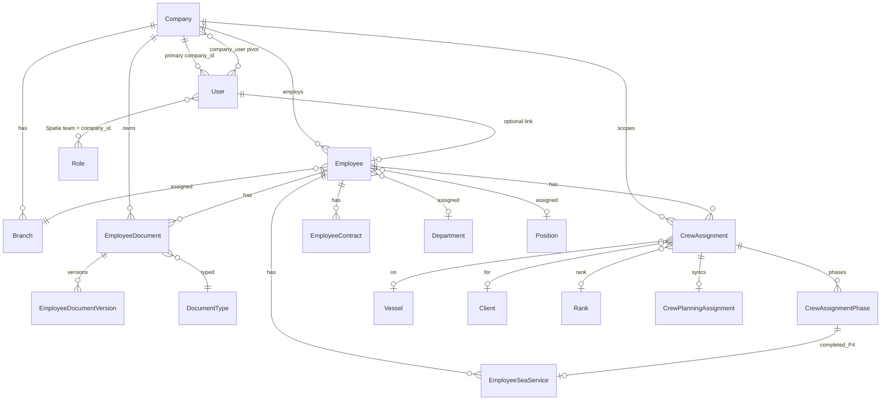
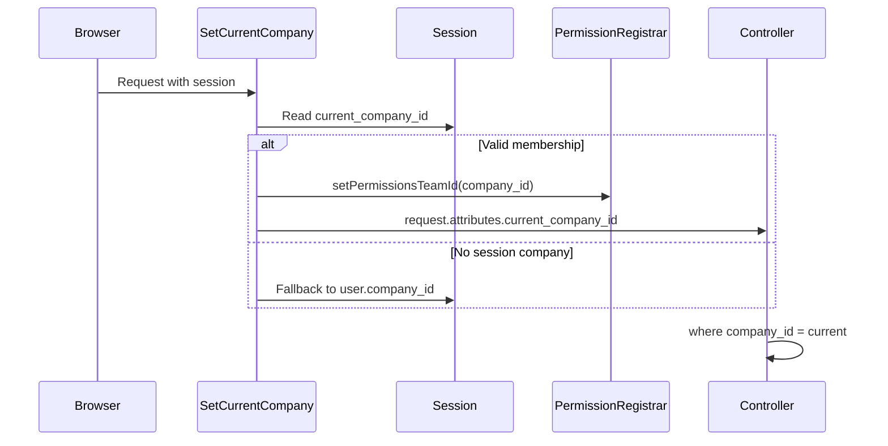
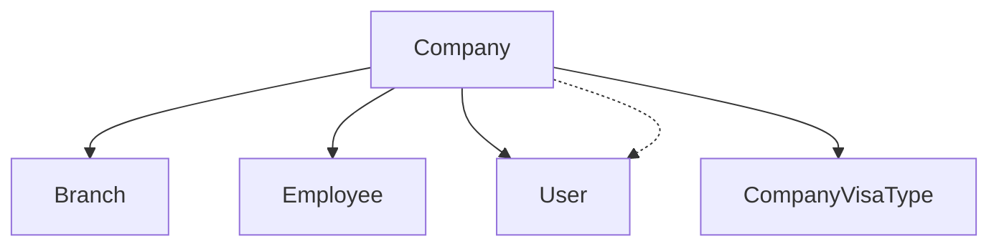
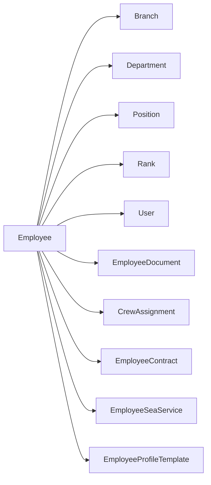
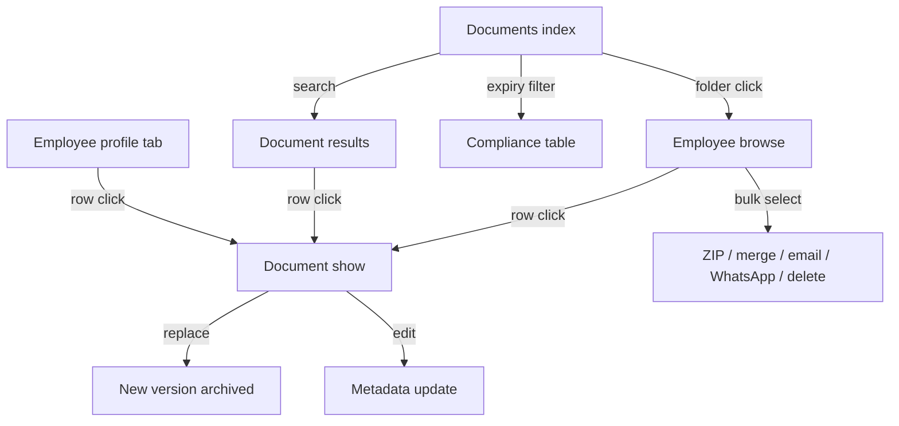
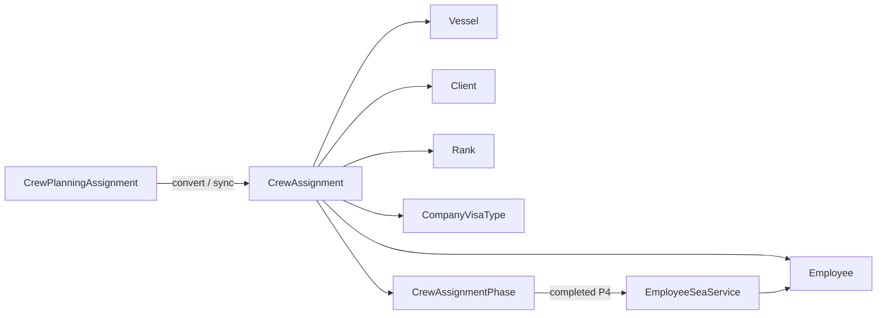
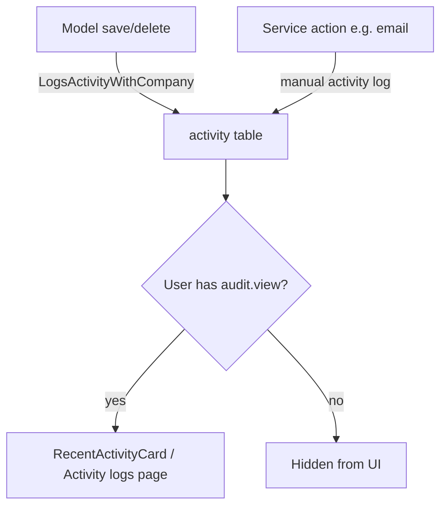
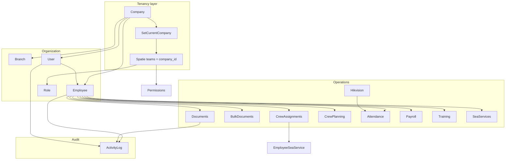

# Business Domains

Domain map for OMS-HRM — a multi-company HR and crew operations system. Each section describes purpose, data model, UI surface, permissions, and key workflows as implemented in this repository.

Related: [project-analysis.md](./project-analysis.md) · [golden-files.md](./golden-files.md) · [docs/permissions.md](../permissions.md)

---

## Domain overview


```mermaid
erDiagram
    Company ||--o{ Branch : has
    Company ||--o{ Employee : employs
    Company ||--o{ User : "primary company_id"
    Company }o--o{ User : "company_user pivot"
    Company ||--o{ EmployeeDocument : owns
    Company ||--o{ CrewAssignment : scopes

    User ||--o| Employee : "optional link"
    User }o--o{ Role : "Spatie team = company_id"

    Employee ||--o{ EmployeeDocument : has
    Employee ||--o{ CrewAssignment : has
    Employee ||--o{ EmployeeContract : has
    Employee ||--o{ EmployeeSeaService : has
    Employee }o--|| Branch : assigned
    Employee }o--o| Department : assigned
    Employee }o--o| Position : assigned

    EmployeeDocument ||--o{ EmployeeDocumentVersion : versions
    EmployeeDocument }o--|| DocumentType : typed

    CrewAssignment ||--o{ CrewAssignmentPhase : phases
    CrewAssignment }o--o| Vessel : on
    CrewAssignment }o--o| Client : for
    CrewAssignment }o--o| Rank : rank
    CrewAssignment ||--o| CrewPlanningAssignment : syncs
    CrewAssignmentPhase ||--o| EmployeeSeaService : completed_P4
```

Most operational data is **scoped by `company_id`**. Users switch the active company in the sidebar; permissions and queries run in that tenant context.

---

## Tenancy

### Purpose

Isolate HR data per organization (company). A single login may access multiple companies via membership; all list/show queries and permission checks use the **currently selected company**.

### Main models

| Model / table | Role |
|---------------|------|
| `Company` | Tenant root — settings, currency, country, payroll config |
| `company_user` pivot | Many-to-many user ↔ company membership with `status` |
| Session `current_company_id` | Active tenant for the request |

There is no separate `Team` Eloquent model. **Team** in Spatie terms = **`company_id`** (see [Teams](#teams)).

### Relationships

- `Company` → `hasMany` `Branch`, `Employee`, documents, and other tenant-owned records scoped by `company_id` (including Crew Assignments).
- `Company` ↔ `User` via `company_user` (membership) and `users.company_id` (primary/home company).

### Controllers / middleware

| File | Role |
|------|------|
| `app/Http/Middleware/SetCurrentCompany.php` | Resolves session company, sets request attribute, sets Spatie team ID |
| `app/Http/Controllers/Organization/CompanySwitchController.php` | POST switch active company |
| `app/Http/Middleware/HandleInertiaRequests.php` | Shares `company_switcher_companies`, `current_company_id` |

### Pages / components

- Company switcher in app sidebar (`components/layout/app-sidebar.tsx`)
- Shared Inertia props consumed across all org pages

### Permissions involved

Tenancy itself is not permission-gated; switching requires membership on `company_user` or matching `users.company_id`.

### Important workflows


```mermaid
sequenceDiagram
    participant Browser
    participant SetCurrentCompany
    participant Session
    participant Spatie as PermissionRegistrar
    participant Controller

    Browser->>SetCurrentCompany: Request with session
    SetCurrentCompany->>Session: Read current_company_id
    alt Valid membership
        SetCurrentCompany->>Spatie: setPermissionsTeamId(company_id)
        SetCurrentCompany->>Controller: request.attributes.current_company_id
    else No session company
        SetCurrentCompany->>Session: Fallback to user.company_id
    end
    Controller->>Controller: where company_id = current
```

1. User logs in (Fortify).
2. `SetCurrentCompany` picks session company or falls back to `user.company_id`.
3. Company-scoped controllers resolve the active tenant from the request attribute (commonly `(int) $request->attributes->get('current_company_id')`) rather than client input.
4. User switches company via sidebar → `CompanySwitchController` → `session('current_company_id')`.

**Future code must:** never trust client-supplied `company_id` for authorization; always scope queries by request attribute.

---

## Teams

### Purpose

In OMS-HRM, **“teams” means Spatie Permission teams**, not a standalone Teams module. Each company is a permission team: roles and direct user permissions are stored with `company_id` on Spatie pivot tables.

### Main models / tables

| Artifact | Role |
|----------|------|
| `config/permission.php` → `'teams' => true` | Enables team feature |
| `team_foreign_key` → `company_id` | Company scopes roles/assignments |
| `spatie_roles` | Roles per company (`roles.company_id`) |
| `spatie_model_has_roles` | User ↔ role with `company_id` team column |
| `spatie_model_has_permissions` | Direct permissions with `company_id` |
| `company_user` | Which companies a user may access (membership, not RBAC) |

### Relationships

- User has roles **per company team** via Spatie.
- User may belong to many companies via `company_user` but holds **different role assignments per company**.

### Controllers

- Role assignment happens in `UserController` (store/update/memberships) with `PermissionRegistrar::setPermissionsTeamId($companyId)`.
- `RoleController` lists/creates roles scoped to `company_id`.

### Pages / components

- `resources/js/pages/organization/roles.tsx` — role matrix per company
- `resources/js/pages/organization/user.tsx` — assign role when editing user
- `resources/js/features/organization/roles/` — role list UI

### Permissions involved

- `roles.view|create|update|delete|export` — manage role definitions
- Role assignment requires `users.update`

### Important workflows

1. Admin creates role in company A → stored with `company_id = A`.
2. Permissions attached to role (global permission catalog, team-scoped assignment).
3. User assigned role while `PermissionRegistrar` team = company A.
4. When user switches to company B, Spatie reloads permissions for team B.

**Distinction:** `company_user` = *can access company*; Spatie team = *what they can do in that company*.

---

## Permissions

### Purpose

Cross-cutting authorization layer. Named permissions use dot notation and are scoped to the active company team. Backend checks are authoritative; frontend checks only shape the UI.

### Main models

| Model | Role |
|-------|------|
| `Spatie\Permission\Models\Permission` | Global permission catalog |
| `Spatie\Permission\Models\Role` | Company-scoped roles |

Backend authorization is mandatory. Frontend `can` props and `useHasPermission` are UX only.

Typical backend patterns:

- Route `can:` middleware for simple capability checks
- Policies (for example `app/Policies/CrewAssignmentPolicy.php`), gates, Form Request `authorize()`, and Support guards for model ownership or state
- Laravel discovers policies in `app/Policies/` by convention

Verify the specific endpoint in `routes/web.php` / `routes/settings.php`. Neighboring routes are not proof of protection. Some routes use platform gates (`platform:view`, `platform:manage`, `platform:database`) plus privileged 2FA; some payroll hub routes authorize inside the controller. Those are existing patterns to verify, not gaps to copy.

### Relationships

- Permissions are global; role ↔ permission and user ↔ role links include `company_id` (team).
- Module-specific `can` arrays built in Support classes (e.g. `DocumentPagePermissions`, `CrewAssignmentPagePermissions`).

### Controllers

Most organization and settings routes use `->middleware('can:permission.name')`. Crew assignment HTTP actions also call `Gate::authorize(...)` against `CrewAssignmentPolicy`. Movement actions use the policy (`performMovement` / `cancel`) after `CrewAssignmentAccess::assertInCompany`.

Dedicated Support:

- `app/Support/EmployeeDocuments/DocumentPagePermissions.php`
- `app/Support/CrewMovements/CrewAssignmentPagePermissions.php`
- `app/Support/Settings/SettingsHubAccess.php`

### Pages / components

- `resources/js/hooks/use-has-permission.ts` — `useHasPermission`, `useSettingsMasterDataCan`
- Permission-gated buttons across all feature modules
- Seeded catalog: `database/seeders/PermissionsSeeder.php`

### Permissions involved

Examples (full list in seeder):

| Group | Sample permissions |
|-------|-------------------|
| Companies | `companies.view`, `.create`, `.update`, `.delete`, `.export` |
| Branches | `branches.*` |
| Employees | `employees.view`, `.create`, `.update`, `.delete`, `.export`, `.import`, sub-record `.manage` |
| Documents | `documents.view`, `.download`, `.share`, `.upload`, `.delete` |
| Contracts / bank / training | `contracts.*`, `bank_accounts.*`, `training.*` |
| Crew | `crew_operations.overview.view`, `crew_operations.vessels.*`, `crew_operations.vessel_manning.*`, `crew_operations.planning.*`, `crew_operations.assignments.*` |
| Attendance / leave | `attendance.overview.view`, `attendance.records.*`, `attendance.types.*`, `attendance.leave-requests.*` (incl. `view_all`), `attendance.leave-approval-policies.*`, `attendance.leave-approval-settings.*` |
| Payroll | `payroll.overview.view`, `payroll.periods.*`, `payroll.crew_timesheets.*`, `payroll.salary_inputs.*`, `payroll.records.view`, payslip and WPS actions |
| Bulk documents | `bulk_documents.view`, `.generate`, `.delete`, `.email`, `.signatures.review` |
| Hikvision | `hikvision.persons.*`, `hikvision.devices.*`, `hikvision.events.*`, `hikvision.webhook.manage` |
| Users / roles | `users.*`, `roles.*` |
| Audit | `audit.view` |

### Important workflows

1. Seed permissions → assign to roles per company → assign roles to users.
2. Request hits the backend authorization boundary → route middleware, a gate/policy, or Form Request checks the permission for the current Spatie team.
3. Controller passes module `can` props to Inertia for UI gating.
4. `HandleInertiaRequests` shares flat `auth.permissions[]` for nav checks.

See [docs/permissions.md](../permissions.md) for document and import permission details.

---

## Companies

### Purpose

Define tenant organizations: legal entity, locale (country, currency, timezone), payroll cycle, working days, branding, and status. Organization → Companies manages the **active** company only; it is not a global tenant registry. Users with multi-company access switch memberships, then manage that tenant.

### Main models

- `Company` — tenant root (`LogsActivityWithCompany`, soft deletes)
- Related: `Country`, `Currency`

### Relationships


```mermaid
flowchart TB
    Company --> Branch
    Company --> Employee
    Company --> User
    Company --> CompanyVisaType
    Company -.-> User
```

- `Company` → `hasMany` `Branch`
- `Company` → `belongsToMany` `User` (membership)
- `Company` → referenced by virtually all org models via `company_id`

### Controllers

| Controller | Actions |
|------------|---------|
| `CompanyController` | index, show, store, update, updateStatus, destroy, export |
| `CompanySwitchController` | switch active company |

### Pages / components

| Path | Role |
|------|------|
| `pages/organization/companies.tsx` | Thin page |
| `features/organization/companies/index.tsx` | List + sheet CRUD |
| `features/organization/companies/components/company-form-sheet.tsx` | Create/edit |
| `pages/organization/company.tsx` | Show/detail with recent activity |

### Permissions involved

`companies.view`, `companies.create`, `companies.update`, `companies.delete`, `companies.export`

### Important workflows

1. **List / CRUD** — the index and export show the **active** company only (filters/search apply to that row). Create still opens a new tenant and attaches the creator as Owner; switch to manage it.
2. **Show / update / status / destroy** — the route-bound `Company` must match `current_company_id` or the request is 404. `companies.*` in the current Spatie team never authorizes another tenant.
3. **Switch** — user selects a **membership** company in the sidebar → session updated → permissions re-scoped. Inaccessible IDs are 403. Platform access is not membership.

---

## Branches

### Purpose

Physical or logical sites within a company (HQ, offices). Employees are assigned to a branch; branch metadata supports contact and headquarters flag.

### Main models

- `Branch` — belongs to `Company`

### Relationships

- `Branch` → `belongsTo` `Company`
- `Employee` → `belongsTo` `Branch`
- Branches do not own employees in a strict hierarchy beyond assignment

### Controllers

`BranchController` — index, show, store, update, updateStatus, destroy, export

### Pages / components

| Path | Role |
|------|------|
| `pages/organization/branches.tsx` | Thin page |
| `features/organization/branches/index.tsx` | **Golden list reference** |
| `features/organization/branches/components/branch-form-sheet.tsx` | Form |
| `features/organization/branches/components/branch-delete-dialog.tsx` | Delete |
| `pages/organization/branch.tsx` | Show/detail |

### Permissions involved

`branches.view`, `branches.create`, `branches.update`, `branches.delete`, `branches.export`

### Important workflows

1. CRUD via side sheet on index page.
2. Inline status toggle (`active` / `inactive`).
3. Show page with activity audit trail.
4. Export respects search/filter query string.

---

## Employees

### Purpose

Core HR record: identity, assignment (branch, department, position, rank), employment status, optional linked login user, and rich sub-records (contracts, documents, training, sea service, etc.). Profile layout driven by **employee profile templates**.

### Main models

| Model | Purpose |
|-------|---------|
| `Employee` | Core HR entity |
| `EmployeeProfileTemplate` | Configurable profile tabs/fields |
| `EmployeeContract` | Employment contract + salary |
| `EmployeeBankAccount` | Banking details |
| `EmployeeEducationQualification` | Education |
| `EmployeeWorkExperience` | Prior jobs |
| `EmployeeTraining` | Courses/certificates |
| `EmployeeVaccination` | Vaccination records |
| `EmployeeLanguage` | Languages |
| `EmployeeSeaService` | Offshore/sea service history |

Master data refs: `Department`, `Position`, `Rank`, `Gender`, `Religion`, `VisaType`, `CompanyVisaType`, `Country`, `Bank`

### Relationships


```mermaid
flowchart LR
    Employee --> Branch
    Employee --> Department
    Employee --> Position
    Employee --> Rank
    Employee --> User
    Employee --> EmployeeDocument
    Employee --> CrewAssignment
    Employee --> EmployeeContract
    Employee --> EmployeeSeaService
    Employee --> EmployeeProfileTemplate
```

### Controllers

| Controller | Scope |
|------------|-------|
| `EmployeeController` | index, create, show, store, update, status, destroy, profile template |
| `EmployeeExportController` | CSV/XLSX/PDF export |
| `EmployeeImportController` | CSV import with granular column permissions |
| `EmployeeUserController` | Create login from employee |
| `EmployeeContractController`, `EmployeeBankAccountController`, … | Sub-record CRUD |
| `EmployeeCvPrintController`, etc. | Printable outputs |

### Pages / components

| Path | Role |
|------|------|
| `pages/organization/employees.tsx` | Directory list |
| `features/organization/employees/employees-content.tsx` | Table + filters |
| `pages/organization/employee.tsx` | **Profile hub** (tabs) |
| `pages/organization/_components/` | Tab panels (documents, contracts, …) |
| `pages/organization/_hooks/use-employee-profile-form.tsx` | Profile form state |
| `pages/organization/employee-import.tsx` | Bulk import UI |
| `features/organization/employees/profile/` | Profile shell, ensure-employee |

### Permissions involved

| Permission | Area |
|------------|------|
| `employees.view` | Directory, profile read |
| `employees.create` | Create / ensure draft employee |
| `employees.update` | Profile edit, status |
| `employees.delete` | Remove employee |
| `employees.export` | Export directory |
| `employees.import` | Employee import, including identity columns |
| `contracts.*`, `bank_accounts.*`, `training.*`, `sea_services.*` (view/create/update/delete/import) | Contracts, bank accounts, training, sea services modules and their import columns |
| `education.*`, `work_experience.*`, `vaccination.*`, `languages.*` | Profile tabs (view/create/update/delete; import on work experience and vaccination) |

### Important workflows

1. **Create** — employee profile template drives fields; `CreateEmployee` action persists the employee and supported nested records.
2. **Profile tabs** — template controls visible fields; each tab posts to nested resource controllers.
3. **Link user** — `EmployeeUserController` creates `User` with `users.create`.
4. **Import** — preview → commit with column-level permission checks.
5. **Print** — CV, offshore CV, salary certificate routes.

---

## Documents

### Purpose

Employee file management: upload, version, expiry tracking, compliance views, bulk download/share/merge/email/WhatsApp, and a dedicated document detail page with inline preview and audit.

### Main models

| Model | Purpose |
|-------|---------|
| `EmployeeDocument` | Current file + metadata |
| `EmployeeDocumentVersion` | Historical file on replace |
| `EmployeeDocumentExpiryAlert` | Scheduled expiry notifications |
| `DocumentType` | Master data type (Passport, Visa, …) |

### Relationships

- `EmployeeDocument` → `belongsTo` `Employee`, `Company`, `DocumentType`, `User` (uploader)
- `EmployeeDocument` → `hasMany` `EmployeeDocumentVersion`
- Documents always scoped by `company_id` + `employee_id`

### Controllers

| Controller | Purpose |
|------------|---------|
| `DocumentsFolderIndexController` | Global index (folders, search, compliance) |
| `EmployeeDocumentsBrowseController` | Per-employee folder browse |
| `EmployeeDocumentShowController` | Document detail page |
| `EmployeeDocumentController` | store, update, replace, destroy, versions JSON |
| `DocumentBulk*Controller` | Bulk download, delete, email, WhatsApp, merge, share links |
| `DocumentFileDownloadController`, `DocumentShareController` | Download / public share |

Support: `DocumentBrowseQuery`, `DocumentAccess`, `StoresEmployeeDocument`, `DocumentBulkActionService`, `DocumentPagePermissions`

### Pages / components

| Path | Role |
|------|------|
| `pages/organization/documents/index.tsx` | Folder grid + search + compliance |
| `pages/organization/documents/employee.tsx` | Employee file table + bulk toolbar |
| `pages/organization/documents/show.tsx` | Detail: preview, versions, activity |
| `pages/organization/_components/documents/employee-documents-tab.tsx` | Profile tab |
| `features/organization/documents/` | Shared UI (rows, expiry, upload, merge, email, WhatsApp) |

### Permissions involved

| Permission | Capability |
|------------|------------|
| `documents.view` | Index, browse, show, preview |
| `documents.upload` | Upload, replace, edit metadata |
| `documents.download` | Single/bulk/folder download, merge |
| `documents.share` | Share links, bulk WhatsApp |
| `documents.delete` | Delete single/bulk |

Frontend `can` from `DocumentPagePermissions::for()` includes WhatsApp/email template options.

### Important workflows


```mermaid
flowchart TD
    A[Documents index] -->|folder click| B[Employee browse]
    A -->|search| C[Document results]
    A -->|expiry filter| D[Compliance table]
    B -->|row click| E[Document show]
    C -->|row click| E
    Profile[Employee profile tab] -->|row click| E
    E -->|replace| F[New version archived]
    E -->|edit| G[Metadata update]
    B -->|bulk select| H[ZIP / merge / email / WhatsApp / delete]
```

1. **Upload** — `StoresEmployeeDocument` optimizes file, stores path, sets expiry status.
2. **Replace** — old file → `EmployeeDocumentVersion`; current row updated.
3. **Expiry** — `DocumentExpiry` calculates status; summary cards on index; compliance filter.
4. **Share** — time-limited share links; WhatsApp templates when integration configured.
5. **Show page** — inline preview, version history, activity log, back navigation by `from` query.

See [docs/document-management.md](../document-management.md), [docs/document-search.md](../document-search.md), [docs/document-sharing.md](../document-sharing.md).

---

## Crew Assignments (Crew Operations)

### Purpose

`CrewAssignment` is the source of truth for one mobilisation cycle (P0–P6). Phases are stored as ordered, repeatable `CrewAssignmentPhase` rows. Completed actual P4 time may sync to `EmployeeSeaService`. Planned sign-off is never actual disembarkation.

**EmployeeDeployment has been removed.** Do not describe deployments, `crew-deployments` routes, or `crew_operations.deployments.*` as current architecture.

Detailed lifecycle, Tour of Duty, planning sync, transfer/redeploy, alerts, and manning: [crew-movement-phases.md](./crew-movement-phases.md).

### Main models

- `CrewAssignment` — one mobilisation cycle; `company_id`, vessel/client/rank, status, planned dates, Tour snapshot
- `CrewAssignmentPhase` — ordered occurrence of P0–P6 (phases may repeat, e.g. P2A → P2B → P2A → P3)
- `CrewPlanningAssignment` — Gantt/planning row; may create/sync a CrewAssignment
- `EmployeeSeaService` — historical sea time linked by `crew_assignment_phase_id`
- `CrewMovementCorrection` — in-place field corrections (separate approval workflow)
- Master data: `Vessel`, `VesselType`, `Client`, `Rank`, `CompanyVisaType`

### Relationships


```mermaid
flowchart LR
    CrewPlanningAssignment -->|convert / sync| CrewAssignment
    CrewAssignment --> Employee
    CrewAssignment --> Vessel
    CrewAssignment --> Client
    CrewAssignment --> Rank
    CrewAssignment --> CompanyVisaType
    CrewAssignment --> CrewAssignmentPhase
    CrewAssignmentPhase -->|completed P4| EmployeeSeaService
    EmployeeSeaService --> Employee
```

Verified Eloquent relations: `Employee::crewAssignments()`, `CrewAssignment` belongs to company/employee/rank/client/vessel and has many phases, planning assignment, corrections; `CrewAssignmentPhase::seaService()`; `EmployeeSeaService::crewAssignmentPhase()`.

### Controllers

- `CrewAssignmentController` — index (Crew / Vessel views), create, show, update (`/organization/crew`)
- `CrewMovementActionController` — `POST .../actions` (`Gate::authorize` performMovement / cancel)
- `VoidCrewAssignmentController` — privileged void
- `CurrentCrewOnboardVesselsExportController` — onboard Excel export
- `CrewPlanningController` / `CrewPlanningAssignmentController` — planning Gantt
- `CrewOperationsDashboardController` / `CrewOperationsSettingsController`
- `CrewMovementCorrectionController` / `CrewMovementCorrectionDecisionController`
- `CrewMovementHistoryController` — report

Support includes `CrewMovementService`, `CurrentCrewQuery`, `CurrentOnboardCrewQuery`, `SeaServiceSyncService`, `CreateCrewAssignmentFromPlanning`, `CrewAssignmentAccess`, `CrewAssignmentPresenter`, `CrewAssignmentPagePermissions`.

Policy: `app/Policies/CrewAssignmentPolicy.php`.

### Pages / components

| Path | Role |
|------|------|
| `pages/organization/crew/index.tsx` | Thin wrapper for Current Crew |
| `features/organization/crew/index.tsx` | Crew / Vessel assignment board |
| `pages/organization/crew/show.tsx` | Assignment detail, phases, movements, corrections |
| `features/organization/crew/actions/movement-action-dialog.tsx` | P0–P6 movement Dialog + Wayfinder |
| `pages/organization/crew-planning/index.tsx` | Planning Gantt / Onboard by Vessel |
| `pages/organization/crew-operations/index.tsx` | Daily operations cockpit |

### Permissions involved

```text
crew_operations.assignments.view|create|update|cancel|void
crew_operations.movements.perform
crew_operations.corrections.view|request|approve|override
crew_operations.planning.view|create|update|delete
crew_operations.overview.view
crew_operations.vessels.*
crew_operations.vessel_manning.*
audit.view
```

Legacy `crew_operations.deployments.*` permissions were removed and migrated onto assignment permissions.

Frontend `can` from `CrewAssignmentPagePermissions::for()`.

### Important workflows

1. **Current Crew** (`/organization/crew`) — operational Draft/Active assignments; Vessel View lists currently onboard active P4 crew.
2. **Planning** — `CreateCrewAssignmentFromPlanning` may create a draft assignment; `SyncPlanningAssignmentFromCrewAssignment` keeps the linked Gantt bar in sync.
3. **Movements** — `CrewMovementService::perform()` in a company-scoped transaction with `lockForUpdate()`.
4. **Sea service** — completed P4 (`actual_start_at` + `actual_end_at`) syncs via `SeaServiceSyncService`.
5. **Corrections** — request/approve workflow; see [crew-movement-corrections.md](./crew-movement-corrections.md).

---

## Vessels (Crew Operations)

### Purpose

Company-owned vessel registry and manning configuration live under **Crew Operations → Vessels**. Vessel Types remain global Settings → Master Data reference data.

Ownership chain:

`VesselType` (global) → `Vessel` (company) → `VesselManning` (company) → Crew Assignments / Planning

`vessels` and `vessel_manning` remain separate tables. Existing vessel rows were backfilled to `company_id = 1` in a one-time migration (no permanent DB default of `1`). Vessel IDs were preserved in place.

### Main models

- `Vessel` — `company_id`, identification fields, soft deletes; unique `(company_id, name)`
- `VesselManning` — `company_id`, `vessel_id`, `rank_id`, `required_count` (child of Vessel; must match vessel company)
- Global reference: `VesselType`, `Rank`

### Controllers

- `Organization\VesselController` — index, show, store, update, destroy, import
- `Organization\VesselManningController` — compatibility redirects for legacy GET URLs; `update` syncs manning (`PUT .../vessels/{vessel}/manning` and legacy `PUT .../vessel-manning/{vessel}`)

Support: `VesselIndexQuery`, `ResolvesCompanyVessels`, `SyncVesselManning`, `StoresVesselCertificate`

### Pages / components

| Path | Role |
|------|------|
| `pages/organization/vessels/index.tsx` | Unified vessel list + manning summary |
| `pages/organization/vessels/show.tsx` | Vessel details + manning requirements + activity |
| `features/organization/vessels/*` | List, show, form sheet |
| `features/organization/vessel-manning/components/vessel-manning-form-sheet.tsx` | Edit rank requirements (reused from Vessel show) |

Legacy Settings Master Data vessel pages and Vessel Manning list pages are not active UIs; GET routes redirect into `/organization/vessels`.

### Permissions involved

- `crew_operations.vessels.view|create|update|delete` — vessel module CRUD
- `crew_operations.vessel_manning.view|create|update|delete` — manning rows (still required to edit requirements)
- Legacy `settings.master-data.vessels.*` kept for compatibility; roles are remapped to the new vessel permissions on migrate
- Roles with `crew_operations.vessel_manning.view` also receive `crew_operations.vessels.view` so they can open the unified module

### Tenant isolation

Vessel selectors (assignments, planning, transfer/redeploy, sea service pickers, import, quick-create) resolve only `vessels.company_id = current_company_id`. Cross-company vessel IDs return 404 (or authorized Form Request denial for manning updates).

---

## Vessel Manning

### Purpose

Define required crew headcount by rank for each company-owned vessel. Example: Vessel A needs 1 Captain and 2 Welders; Vessel B may differ. Editing happens on the Vessel show page under Crew Operations → Vessels (not a standalone sidebar module).

### Main models

- `VesselManning` — `company_id`, `vessel_id`, `rank_id`, `required_count`
- Parent: company-owned `Vessel`; global `Rank` / `VesselType`

### Controllers

`VesselManningController` — legacy GET redirects to vessels; update syncs requirements for one vessel via `SyncVesselManning`

Support: `VesselManningIndexQuery`, `SyncVesselManning`

### Pages / components

Manning UI is embedded in `features/organization/vessels/show.tsx` using `VesselManningFormSheet`. Standalone `vessel-manning` page entrypoints remain only as unused legacy shells behind redirects.

### Permissions involved

- `crew_operations.vessel_manning.view` — view manning (and reach vessels via remapped `vessels.view`)
- `crew_operations.vessel_manning.create` — add manning to a vessel with no existing rows
- `crew_operations.vessel_manning.update` — change existing manning rows
- `crew_operations.vessel_manning.delete` — clear all manning rows for a vessel

---

## Crew Planning and Operations

### Purpose

Plan employee assignments against vessels and expose an operational overview alongside Crew Assignments and manning data.

Current Crew (`/organization/crew`) is operational state, not planning. **Crew View** lists current assignments; **Vessel View** (`?view=vessel`) groups currently onboard active P4 crew by vessel. Crew Planning (`/organization/crew-planning`) defaults to the Gantt; **Onboard by Vessel** (`?view=onboard-vessels`) reuses the same actual P4 vessel roster and does not treat planning records as onboard. See [Crew Movement Phases](./crew-movement-phases.md).

### Main artifacts

- `CrewPlanningAssignment` and `CrewOperationsSetting`
- `CrewPlanningController`, `CrewPlanningAssignmentController`, `CrewOperationsDashboardController`, `CrewOperationsSettingsController`
- `pages/organization/crew-planning/index.tsx` and `pages/organization/crew-operations/`

### Permissions involved

- `crew_operations.overview.view`
- `crew_operations.planning.view|create|update|delete`

Overview uses `can:crew_operations.overview.view`. Settings use `can:crew_operations.planning.view` (read) and `can:crew_operations.planning.update` (write). Verify any new Crew Operations route independently.

---

## Training

### Purpose

Manage employee training records and files both from the organization-wide training browser and from an employee profile.

### Main artifacts

- `EmployeeTraining` and `EmployeeTrainingVersion`
- `TrainingsIndexController`, `EmployeeTrainingsBrowseController`, `EmployeeTrainingController`, `EmployeeTrainingShowController`
- `pages/organization/training/` and the employee training profile tab

### Permissions involved

`training.view`, `training.create`, `training.update`, `training.delete`, `training.import`

---

## Sea Services

### Purpose

Manage employee sea service history from the organization-wide sea services browser and from an employee profile. The browser includes inactive and terminated employees because sea service is historical. Completed P4 crew assignments continue to sync into `EmployeeSeaService`. See [Active employee visibility](./active-employee-visibility.md).

### Main artifacts

- `EmployeeSeaService`
- `SeaServicesIndexController`, `EmployeeSeaServicesBrowseController`, `SeaServiceShowController`, `EmployeeSeaServiceController`
- `pages/organization/sea-services/` and the employee sea service profile tab

### Permissions involved

`sea_services.view`, `sea_services.create`, `sea_services.update`, `sea_services.delete`, `sea_services.import`

---

## Attendance and Leave

### Purpose

Track attendance records, leave types and balances, leave requests, multi-step leave approvals, attachments, and calendar views.

### Leave approval policies

Companies configure ordered approval policies (`LeaveApprovalPolicy` + `LeaveApprovalPolicyStep`) with approver types: department manager, parent manager, HR approver, and specific employee. Departments may assign a policy directly or inherit one; otherwise the company default policy applies. Company HR/fallback approvers and leave-request email notification switches live in `CompanyLeaveApprovalSetting`. The company default policy must remain active; default switches lock the company row and stay company-scoped.

Company leave email notification controls (Attendance → Leave Approval Policies → Settings) are scoped to the trusted active `current_company_id`, not Application Settings. A master switch (`email_notifications_enabled`) gates all leave-request emails; event switches cover submission, update, next-approver activation, and final approved/rejected decisions, plus optional CC of the deciding approver on the final-decision mail. Email Templates still control message content and must also be enabled. Disabling these switches does not change approval workflow, balance handling, authorization, or status transitions. Permissions remain `attendance.leave-approval-settings.view` and `attendance.leave-approval-settings.update`.

On submit, `SubmitLeaveRequestWithApprovals` atomically validates the active employee/leave type, serializes concurrent same-employee submissions under an employee row lock, re-checks date overlap, reserves balance under year-row locks, stores attachments inside the same transaction, and snapshots the resolved chain into `leave_request_approvals` (including policy id/name and step label provenance). Notifications queue only after commit when company notification settings and the matching EmailTemplate allow it; attachment or policy failure rolls everything back.

Approvers act only on the single current pending step (`ApproveLeaveRequestStep` / `RejectLeaveRequestStep`). Actionable approvers must have an active employee, linked active user, active company membership, and both `attendance.leave-requests.view` and `attendance.leave-requests.approve`. `attendance.leave-requests.view_all` is required to list/manage all employees’ requests.

Pending leave requests may be edited only before any approval step has acted. Pre-action edits are no-op safe, re-check overlap under lock, replace balance reservations with same-key credit only, rebuild the unacted approval snapshot, write a company-scoped audit entry for real edits, and notify the newly resolved current pending approver after commit. After approval starts, updates are rejected.

List scopes: `my`, `awaiting_my_approval` (current pending steps), `assigned_to_me` (current and historical assignments; does not grant approve rights), and `all` (requires `view_all`).

Balance operations use focused methods (`reserveIfAvailable`, `releasePendingReservation`, `convertPendingToUsed`, `replacePendingReservation`, `synchronizeBalanceKey`). Approval conversion fails if the pending reservation is missing rather than increasing used alone.

Backfill (`leave-approvals:backfill`) is non-destructive: existing approval rows are never deleted or replaced (`--force` only warns and skips). Dry-run performs no writes (settings resolution is read-only) and reports **Would create** separately from **Created**. Approver emails require explicit `--notify`, are never sent in dry-run, and increment **Notifications scheduled** only when scheduling is actually attempted for an actionable pending approver.

Assigned approvers may view a request and act on their current pending step only. Edit, cancel, and ordinary delete require ownership (linked employee) or `view_all` plus the matching mutation permission. Direct deletion is rejected once any approval step has been acted; cancel preserves completed approval history.

Privileged administrators with `attendance.leave-requests.view` + `view_all` + `delete_any` may **void and remove** a request in any status via `AdministrativelyDeleteLeaveRequest`. That path soft-deletes the request, records the prior status and reason, reverses balance exactly once (pending release / approved used reversal / no mutation for rejected or cancelled), cancels only open approval steps, preserves completed approvals/comments/provenance and attachment files, and writes a company-scoped audit activity visible to `audit.view`.

`SetCurrentCompany` only activates active companies with an active `company_user` membership (or the legacy home-company path when no pivot row exists). EmailTemplatesSeeder creates missing leave templates without overwriting administrator subject/body/enabled/preset customizations, including `leave_request_updated` and `leave_request_approver_action_required`.

### Production rollout (leave approvals)

1. Run migrations.
2. Seed permissions: `php artisan db:seed --class=PermissionsSeeder`  
   Permission seeding creates permission records but **does not** assign them to existing company roles.
3. Assign new permissions to existing company roles (Organization → Roles):
   - `attendance.leave-requests.view_all`
   - `attendance.leave-requests.delete_any` (only for trusted HR/system administrators who may void requests)
   - `attendance.leave-approval-policies.*`
   - `attendance.leave-approval-settings.view|update`
4. Configure one active company default policy and/or department policies.
5. Configure HR/fallback approvers where used.
6. Confirm every actionable approver has: active employee, linked active user, active company membership, and leave-request **view + approve** permissions.
7. Run `php artisan leave-approvals:backfill --dry-run --company=<id>` and review configuration failures.
8. Run backfill without notifications.
9. Use `--notify` only when intentionally sending action-required mail.
10. Verify leave balances after rollout.
11. Perform a manager-only and multi-step approval smoke test.

Also seed email templates when deploying notification changes: `php artisan db:seed --class=EmailTemplatesSeeder` (creates missing leave templates including `leave_request_updated` and `leave_request_approver_action_required` without overwriting admin customizations).

### Main artifacts

- `AttendanceRecord`, `LeaveType`, `LeaveBalance`, `LeaveRequest`, `LeaveApprovalPolicy`, `LeaveApprovalPolicyStep`, `LeaveRequestApproval`, `CompanyLeaveApprovalSetting`
- Controllers under `app/Http/Controllers/Attendance/`
- Pages under `resources/js/pages/attendance/`

### Permissions involved

- `attendance.overview.view`
- `attendance.records.view|create|update|delete|manage`

`attendance.records.manage` is same-company HR/admin attendance. Without it, create/update/delete apply only to the user's linked Employee in the **active** company. `employee_id` from the client is not authorization. Cross-company employees are 404. Hikvision sync is separate ingestion.

- `attendance.types.view|create|update|delete`
- `attendance.leave-requests.view|view_all|create|update|delete|delete_any|approve`
- `attendance.leave-approval-policies.view|create|update|delete`
- `attendance.leave-approval-settings.view|update`

---

## Payroll

### Purpose

Manage payroll periods, crew timesheets, salary inputs, generated payroll records, payslips, and WPS export.

### Main artifacts

- `PayrollPeriod`, `CrewTimesheet`, `SalaryInputType`, `SalaryInput`, `PayrollRecord`
- Controllers under `app/Http/Controllers/Payroll/`
- Pages under `resources/js/pages/payroll/`

### Permissions involved

- overview: `payroll.overview.view`
- lifecycle: `payroll.periods.view|create|update|delete|approve|mark_paid|cancel|recalculate` and the `revert_to_*` actions
- inputs: `payroll.crew_timesheets.*` and `payroll.salary_inputs.*`
- outputs: `payroll.records.view`, `payroll.payslips.generate`, `payroll.payslips.email`, `payroll.wps.export`

Some payroll hub routes authorize inside the controller (for example `authorizePayrollHub` / `authorizePayrollShow`) rather than via route `can:` middleware. Crew timeline prepare/submit/approve/return/apply routes use `can:payroll.crew_timesheets.*`. Verify the specific endpoint before treating it as protected.

---

## Hikvision

### Purpose

Integrate Hikvision people, devices, and access events with employees and attendance processing. Webhooks are exposed separately from authenticated administration routes.

### Main artifacts

- `HikvisionSetting`, `HikvisionPerson`, `HikvisionDevice`, `HikvisionAccessEvent`
- Controllers under `app/Http/Controllers/Hikvision/` and `Webhooks/HikvisionWebhookController`
- `pages/hikvision/persons.tsx`, `pages/hikvision/access-events.tsx`, and the Hikvision application-settings tab

### Permissions involved

- `settings.integrations.hikvision.view|update`
- `hikvision.persons.view|sync|create|update|delete|link`
- `hikvision.devices.view|sync`, `hikvision.events.view|fetch`, `hikvision.webhook.manage`

---

## Bulk Documents and E-signing

### Purpose

Generate and email document batches, collect public signatures through signed links, review submitted signatures, and download approved outputs.

### Main artifacts

- Models prefixed with `BulkDocument*`
- Controllers under `app/Http/Controllers/Organization/BulkDocuments/` and `app/Http/Controllers/Public/DocumentEsign/`
- `features/organization/documents/bulk/bulk-documents-content.tsx` and `pages/esign/index.tsx`

### Permissions involved

`bulk_documents.view`, `bulk_documents.generate`, `bulk_documents.delete`, `bulk_documents.email`, `bulk_documents.signatures.review`

Public e-sign routes use signed URLs and throttling rather than company-role permissions. Administrative generation, email, review, and download flows remain company-scoped.

---

## Settings and Master Data

### Purpose

Manage security and appearance preferences, application/email/integration configuration, document-signature placement, message templates, and reusable master-data catalogs.

### Main artifacts

- Routes in `routes/settings.php`
- Controllers under `app/Http/Controllers/Settings/`
- Pages under `resources/js/pages/settings/`

### Permissions involved

- `settings.security.*`, `settings.appearance.view`, `settings.application.*`
- `settings.integrations.whatsapp.*`, `settings.integrations.hikvision.*`, and template permissions
- `settings.master-data.{resource}.view|create|update|delete`

Integration secrets are server-side values. Inertia props expose masked placeholders and `has_*` flags, never decrypted credentials.

---

## Users

### Purpose

Application login accounts (Fortify): authentication, 2FA, avatar, status, company membership, role assignment, and optional link to an `Employee` record. The User row is a global identity; tenancy is the membership, not `users.id`.

### Main models

- `User` — authenticatable (`HasRoles`, `TwoFactorAuthenticatable`, soft deletes)
- `company_user` pivot — multi-company membership

### Relationships

- `User` → `belongsTo` `Company` (primary `company_id`)
- `User` → `belongsToMany` `Company` via `company_user`
- `User` → `hasOne` `Employee` (optional HR link)
- Spatie roles assigned per company team

### Controllers

| Controller | Actions |
|------------|---------|
| `UserController` | index, show, store, update, status, destroy, export, memberships |
| `EmployeeUserController` | Create user from employee |

Support: `CreateOrganizationUser`, `SyncUserEmployeeLink`, `CopyEmployeeAvatarToUser`

### Pages / components

| Path | Role |
|------|------|
| `pages/organization/users.tsx` | User directory |
| `features/organization/users/` | List, filters, form sheet |
| `pages/organization/user.tsx` | Show + edit + linked employee |
| Auth pages under `pages/auth/` | Login, 2FA, password reset |

### Permissions involved

`users.view`, `users.create`, `users.update`, `users.delete`, `users.export`

Creating login from employee requires `users.create`.

### Important workflows

1. **Create user** — assign a role from the **active** company team; optional employee link. `users.update` may assign any role defined for that company; `roles.update` edits the matrix.
2. **Memberships** — add/update/remove `company_user` rows for the **active** company only. Client `company_id` is ignored. Dual-company users must switch before administering another tenant. Platform access is not membership.
3. **Employee link** — `SyncUserEmployeeLink` sets `employees.user_id`; optional avatar copy.
4. **Authentication** — Fortify + optional 2FA; `last_login_at` recorded on login.

---

## Roles

### Purpose

Company-scoped role definitions that bundle permissions. Admins configure the permission matrix per company; users receive one primary role per company (typical pattern in user list).

### Main models

- `Spatie\Permission\Models\Role` — `company_id` column
- `Spatie\Permission\Models\Permission` — global catalog

### Relationships

- Role → `belongsToMany` Permission
- User → `belongsToMany` Role (with `company_id` on pivot = team)

### Controllers

`RoleController` — index, show, store, update, destroy, export

### Pages / components

| Path | Role |
|------|------|
| `pages/organization/roles.tsx` | Role list + permission matrix |
| `pages/organization/role.tsx` | Single role detail |
| `features/organization/roles/` | Feature module |

### Permissions involved

`roles.view`, `roles.create`, `roles.update`, `roles.delete`, `roles.export`

### Important workflows

1. List roles for current company.
2. Create/edit role → attach permissions from global catalog.
3. Assign role to user (user edit flow) under current Spatie team.
4. Export roles for audit/compliance.

---

## Auditing

### Purpose

Record who changed what and when. Uses **Spatie Activity Log** with company scoping. Surfaces as per-entity “Recent activity” on show pages and a global searchable **Activity logs** page.

### Main models / infrastructure

| Component | Role |
|-----------|------|
| `LogsActivityWithCompany` trait | Sets `company_id` on activity rows |
| `Spatie\Activitylog\Models\Activity` | Stored audit entries |
| `RecentActivityQuery` | Fetch latest N for show pages |

Automatic activity logging now spans organization records, master data, employee sub-records, Crew Assignments / planning, attendance and leave, and payroll records. The authoritative implementation list is the set of models using `LogsActivityWithCompany`; avoid copying a static model count into documentation because coverage changes as modules evolve.

Custom events (e.g. document email send) logged manually in Services.

### Relationships

- Activity → morph to `subject` (changed model)
- Activity → `causer` (`User` who made change)
- Filtered by `company_id`

### Controllers

| Controller | Purpose |
|------------|---------|
| `ActivityLogController` | Global paginated log (`audit.view`) |
| Show controllers | Pass `recent_activity` + `can_view_audit` |

### Pages / components

| Path | Role |
|------|------|
| `pages/organization/activity-logs.tsx` | Global audit browser |
| `components/recent-activity-card.tsx` | Show-page activity section |
| `features/organization/crew-operations/components/recent-activity-card.tsx` | Crew Operations dashboard activity slice |

### Permissions involved

- `audit.view` — required for activity logs page and `RecentActivityCard` on show pages
- Without permission: controllers return `recent_activity: []`, `can_view_audit: false`

### Important workflows


```mermaid
flowchart TD
    A[Model save/delete] -->|LogsActivityWithCompany| B[activity table]
    C[Service action e.g. email] -->|manual activity log| B
    B --> D{User has audit.view?}
    D -->|yes| E[RecentActivityCard / Activity logs page]
    D -->|no| F[Hidden from UI]
```

1. Model change → Spatie logs dirty attributes with `company_id`.
2. Show page → `RecentActivityQuery::for($user, $companyId, Model::class, $id)`.
3. Global page → filter by date, event, subject type, search query.

---

## Cross-domain dependency map


```mermaid
flowchart TB
    subgraph tenancy [Tenancy layer]
        Company
        SetCurrentCompany
        SpatieTeams[Spatie teams = company_id]
    end

    subgraph org [Organization]
        Branch
        Employee
        User
        Role
    end

    subgraph operations [Operations]
        Documents
        BulkDocuments
        CrewAssignments
        CrewPlanning
        Attendance
        Payroll
        Training
        SeaServices
        Hikvision
    end

    subgraph audit [Audit]
        ActivityLog
    end

    Company --> SetCurrentCompany
    SetCurrentCompany --> SpatieTeams
    SpatieTeams --> Role
    SpatieTeams --> Permissions

    Company --> Branch
    Company --> Employee
    Company --> User
    User --> Employee
    Employee --> Documents
    Employee --> BulkDocuments
    Employee --> CrewAssignments
    Employee --> CrewPlanning
    Employee --> Attendance
    Employee --> Payroll
    Employee --> Training
    Employee --> SeaServices
    Hikvision --> Attendance
    CrewAssignments --> EmployeeSeaService

    Employee --> ActivityLog
    Documents --> ActivityLog
    User --> ActivityLog
```

---

## Module index (quick reference)

| Domain | Primary routes | Primary pages |
|--------|----------------|---------------|
| Companies | `/organization/companies` | `companies.tsx`, `company.tsx` |
| Branches | `/organization/branches` | `branches.tsx`, `branch.tsx` |
| Employees | `/organization/employees` | `employees.tsx`, `employee.tsx` |
| Documents | `/organization/documents` | `documents/index`, `employee`, `show` |
| Bulk documents / e-sign | `/organization/documents/bulk`, `/esign/{token}` | document bulk screen, `esign/index.tsx` |
| Contracts | `/organization/contracts` | `contracts/index`, `employee`, `no-contract` |
| Bank accounts | `/organization/bank-accounts` | `bank-accounts/index`, `employee`, `no-account` |
| Training | `/organization/training` | `training/index`, `employee`, `show` |
| Sea services | `/organization/sea-services` | `sea-services/index`, `employee`, `show` |
| Crew Assignments | `/organization/crew` | `crew/index`, `show`, `create`, `edit` |
| Crew operations / planning | `/organization/crew-operations`, `/organization/crew-planning` | `crew-operations/*`, `crew-planning/index` |
| Vessel / manning | `/organization/vessels` | `vessels/index`, `show` (legacy `/organization/vessel-manning` redirects here) |
| Attendance / leave | `/attendance/*` | `attendance/overview`, `records`, `calendar`, `types`, `leave-requests`, `leave-approval-policies`, `leave-approval-settings` |
| Payroll | `/payroll/*` | `payroll/overview`, `index`, `show`, `records`, `salary-inputs` |
| Hikvision | `/hikvision/persons`, `/hikvision/access-events` | `hikvision/persons`, `access-events` |
| Users | `/organization/users` | `users.tsx`, `user.tsx` |
| Roles | `/organization/roles` | `roles.tsx`, `role.tsx` |
| Activity logs | `/organization/activity-logs` | `activity-logs.tsx` |
| Settings / master data | `/settings/*` | `settings/*`, `settings/master-data/*` |

Authoritative route and permission sources: `routes/web.php`, `routes/settings.php`, and `database/seeders/PermissionsSeeder.php`. Use `php artisan route:list` with an appropriate `--path` filter when validating a module.
